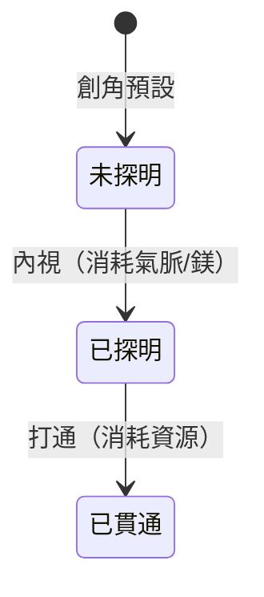
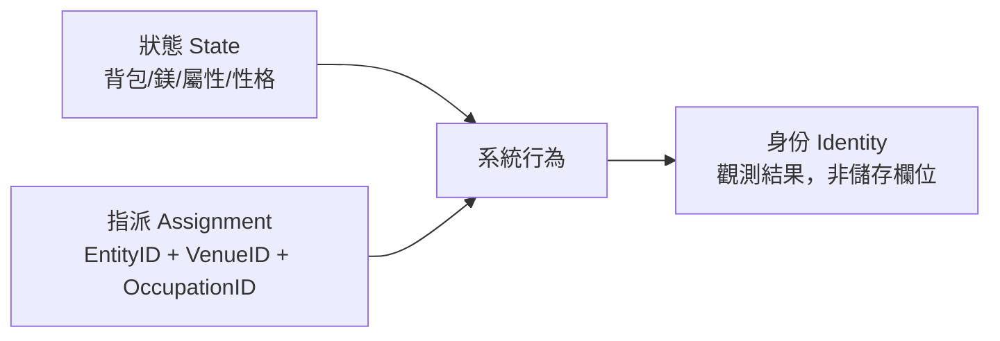

# 迷霧機制與身份分離

本頁涵蓋角色系統中「資訊揭露」與「行為湧現」兩大機制：迷霧控制玩家對自身拓撲的認知進程，狀態/指派/身份分離則定義 NPC（與玩家）在世界中如何被觀測。

## 迷霧機制（名存實未知）（`設計中`）

所有 361 個節點名稱恆顯，但功能性內容（Cost、適性、屬性加成）在未被探明前顯示為 `[未知]`。

### 三層狀態

| 狀態 | 可見資訊 | 可操作 |
|------|----------|--------|
| **未探明** | 名稱可見，Cost 顯示 `[未知]` | 無法打通 |
| **已探明** | Cost 正常顯示（語意標籤 + 精確值） | 可打通 |
| **已貫通** | 節點 ID 在 `activated_nodes` 中 | 已生效 |



### 探明規則：內視

- 消耗氣脈或鎂，將目標節點加入已探明清單
- **限制**：只能探明與已探明/已貫通節點直接相連的節點
- 起點 N000（生之奇點）預設貫通，因此初始可探明範圍為 N000 直連的 20 個主樞

### 設計意圖

迷霧機制讓「命盤」不是一張攤開的底牌，而是需要投入資源逐步揭露的探索過程。這與創角 Onboarding 敘事（瞥見 360 星體→氣體遮蔽→迷霧籠罩）形成呼應。

---

## 狀態、指派與身份分離

### 核心公式

```
[ 本體狀態 (State) ] + [ 情境指派 (Assignment) ] = 系統行為 → 玩家觀測到的「身份」(Identity)
```



### 三者定義

**狀態 (State)**：實體客觀存在的資料——背包、鎂、屬性、[[soulseed|SoulSeed]] 性格傾向。狀態是觸發一切行為的根源（需求驅動）。角色不因「我是員工」而工作，而因「鎂餘額極低」觸發求職行為。

**指派 (Assignment)**：連接實體與場所(Venue)及職務(Occupation)的暫時性槽位綁定。資料結構為：

```
Assignment{EntityID, VenueID, OccupationID}
```

系統依此為實體開放特定動作插座。拔除指派，角色立刻失去相關職能。

**身份 (Identity)**：基於狀態＋行為＋指派環境**動態推導**的觀測結果。不是資料庫中的獨立字串。客棧經理下班離開後，在他人眼裡就是路人——身份隨情境消散。

### 場所（Venue）

場所帶一組 `room_ids`，僅列出的房間算「在場」（不採 zone，避免地圖色塊過多）。NPC 在場時獲得職業動作插座，不在場時僅預設插座。

### 對話與動作模板分離

| 模板類型 | 綁定依據 | 生效範圍 |
|----------|----------|----------|
| 職業對話模板 | 職業（任命） | 任時任地 |
| 職業動作模板 | 場所綁定 | 僅在綁定場所的 room_ids 內 |
| 公共對話模板 | 無 | 任時任地（fallback） |
| 公共動作模板 | 無 | 即 Agent 預設插座（Talk, Look, Attack, Trade） |

### 無職行為的湧現

無指派的 NPC 依狀態驅動行為：
- 鎂極低 → 乞討或求職
- 有貨有利差 → 帶貨移動 + 開放 Trade → 玩家觀測為**行腳商**

身份是觀測結果，不需標籤欄位。

---

## 角色模板結構

玩家與 NPC 共用同一套實體結構。

### 識別欄位

| 欄位 | 說明 |
|------|------|
| id | 唯一識別 |
| kind | `player` / `npc` |
| display_char | 圓內一字（地圖/列表顯示用） |
| display_title | 狀態分頁命途顯示之稱謂，空則「無名之輩」（`已實作`） |

### 先天欄位（SoulSeed）

| 欄位 | 說明 |
|------|------|
| soul_seed | int64，創角時產生並必存。展開三軸與 760 邊權（`已實作`） |
| activated_nodes | 已貫通節點 ID 清單，預設 `["N000"]`（`已實作`） |

### 有效屬性欄位

| 欄位 | 狀態 |
|------|------|
| 體質/氣脈/靈敏 | 由三軸映射產出基礎值（`已實作`） |
| 竅穴打通狀態 | 對應普通加成（`未實作`） |
| 詞元入竅 | 各竅穴填入之詞元（`未實作`） |
| 裝備槽 | 外在詞盤提供工具維度加成（`未實作`） |

### 互動欄位

| 欄位 | 說明 |
|------|------|
| sockets | 可執行動作清單（`已實作`，最小集 Talk/Attack/Look） |
| 鎂 | 持有貨幣數量（`已實作`） |

### UI 彈窗四分頁

| 分頁 | 內容 | 狀態 |
|------|------|------|
| **狀態** | 命途、本源、維度(體敏氣)、四相(氣血/內力/精神/體力)、持有(鎂) | `已實作` |
| **裝備** | 17 槽位列表 | `未實作` |
| **技能** | 運轉功法、實戰招式池、語境推演 | `未實作` |
| **星盤** | 361 竅穴網路層級式呈現 | `部分已實作` |

---

## NPC 生成流程

### 設計原則

NPC 生成與玩家一致：**只帶 SoulSeed 的實體**，職業與身份不在生成當下綁定。

### 流程（`部分已實作`）

1. **生成實體**：`InsertNPC(id, displayChar, gender)` — 不寫 displayTitle，與玩家創角同邏輯（seed → 屬性/穿搭）
2. **建立場所**：Venue 帶 room_ids（如浮生客棧）
3. **指派職務**：`Assignment(entity_id, occupation_id, venue_id, assigned_by)`
4. **掛載模板**：依指派的 occupation 掛載對話/行為模板

### 身份解析（`已實作`）

`GetNPCTitle` 查詢 assignments → occupation 名稱。無指派時 fallback `display_title` 或預設「路人」。

### 插座解析（`已實作`）

`GetSocketsForNPC(db, entityID, roomID)` — 預設插座 + 在場時加職業 action_sockets。非預設動作執行時檢查是否在綁定場所內。

### 對話介面（`設計中`）

支援雙模式：
- **自由輸入**：玩家打字 → 系統抓關鍵字 → 搜回應池 → 回傳
- **點選對話**：可選關鍵字列表 → 對應池取句

多職業同一 key 時合併池隨機抽。無命中時 fallback 公共對話池。
