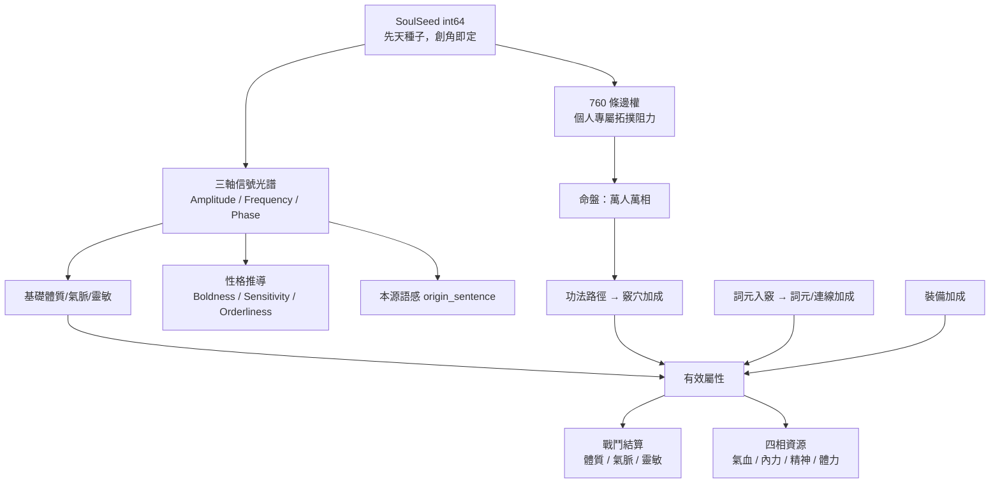

# 角色系統

> 奇點世界角色系統總覽。涵蓋角色屬性結構、361 拓撲網路、星盤與命盤機制、狀態／身份／指派分離、角色模板與 NPC 生成流程。

## 核心哲學

**有限框架中的無限可能**。玩家與 NPC 共用同一套實體結構（玩家＝NPC），差異由 SoulSeed 與後天路徑自然產生。

**外顯與內在**：**體質、氣脈、靈敏**為角色最直觀的外顯三維——對戰鬥與生活系統暴露的有效屬性僅此三項。內在為 361 節點（含唯一生之奇點 N000 ＋ 其餘 360 節點收斂為體／氣／敏三系）與三軸信號光譜；內在產出並驅動外顯體敏氣，裝備為可剝離之外在工具。

## 架構總覽



## 邏輯閉環

```
SoulSeed → 三軸（→ 基礎體敏氣）＋ 拓撲阻力
  → 功法路徑／打通／繞路
    → 竅穴普通加成(體氣敏) ＋ 詞元入竅與造句
      → 詞元／連線加成(體氣敏) ＋ SkillObject
        → 有效體敏氣 ＋ 裝備
          → 戰鬥 f(有效體敏氣, 技能, 裝備)
```

與[[wordplate-system|詞盤系統]]、[[economy|經濟系統]]、玩家＝NPC 一致。

## 前端 UI 用語對照

人物彈窗【狀態】與【星盤】分頁之用語對照：

| 系統概念 | UI 用語 | 說明 |
|----------|---------|------|
| 體質、氣脈、靈敏 | **維度** | 外顯三維 |
| 氣血、內力、精神、體力 | **四相** | 四項資源統稱 |
| 三軸信號光譜之敘事化一句話 | **本源** | 不直接顯示能階／時脈／相位數字 |
| 361 竅穴網路 | **星盤** | UI 第四分頁命名 |
| 代碼邏輯層 | **InnerPlate**（內盤） | 變數、Service、註釋統一用法 |

## 子頁面

| 主題 | 頁面 | 摘要 |
|------|------|------|
| 外顯三維與四相 | [[three-dimensions]] | 體質/氣脈/靈敏三維屬性、四相資源公式、有效屬性計算、詞元入竅三階共振 |
| SoulSeed 與性格 | [[soulseed]] | SoulSeed 機制、三軸信號光譜、性格推導（Boldness/Sensitivity/Orderliness）、本源語感、命盤 |
| 361 拓撲系統 | [[topology-361]] | 四區分層、二十主樞、五常邏輯閘、十二微型狀態、760 條邊權生成演算法、能量循環 |
| 迷霧與身份 | [[fog-and-identity]] | 迷霧機制（名存實未知）、狀態/指派/身份分離、角色模板、NPC 生成流程、無職行為湧現 |

## 萬人萬相鐵律

任何設計不得：
1. 為 SoulSeed 三軸賦予職業/流派/原型的語義映射
2. 以預設模板覆蓋 SoulSeed 的決定性生成結果
3. 讓後天操作改變 SoulSeed 或 760 Cost 的值（內盤不可變性）

## 已廢除設計

- 四型念紋 — 已收斂為三軸連續值
- 出身×念紋加權 — 基礎體敏氣＝三軸映射，單一來源

## 實作狀態總覽

| 系統 | 狀態 | 說明 |
|------|------|------|
| SoulSeed 與三軸展開 | `已實作` | seed → amp/freq/phase → 基礎體敏氣 |
| 本源語感（GenerateOriginSentence） | `已實作` | 三軸→形容詞拼句 |
| 性格推導（Personality） | `已實作` | 三軸→Boldness/Sensitivity/Orderliness |
| Boldness 對話偏移 | `已實作` | Talk 句池依 Boldness 偏移 |
| 狀態分頁 UI（命途/維度/四相/持有） | `已實作` | 人物彈窗第一分頁 |
| 星盤分頁骨架 | `已實作` | 層級結構 + Cost 綁定 |
| Cost 通暢度標籤（五級語意） | `已實作` | 暢流/順通/平穩/滯澀/險阻 |
| activated_nodes 欄位 | `已實作` | 預設 `["N000"]` |
| 身份與職業分離（Assignment） | `已實作` | Venue + Assignment + Occupation |
| 插座依場所動態解析 | `已實作` | GetSocketsForNPC |
| 迷霧機制（revealed_nodes / 內視） | `設計中` | 規格已定，第一版暫不實作 |
| 竅穴打通流程 | `未實作` | 361 節點打通/煉化 |
| 詞元入竅與造句 | `未實作` | 語意判定 → SkillObject |
| 功法藍圖 | `未實作` | 路徑定義（靜態功法表或自創） |
| 裝備系統 | `未實作` | 17 槽位 |
| 性格→決策引擎權重 | `設計中` | 求職/留任/離職加權 |
| 關鍵字對話檢索 | `設計中` | 自由輸入 + 點選 |

## 已知斷點（第一版可簡化或後補）

1. **功法藍圖**：路徑由「功法」定義，規格未單獨成檔；第一版可用靜態功法表或僅做單點打通不強制路徑
2. **內視**：揭露拓撲／阻力的時機與消耗見[[fog-and-identity|迷霧機制]]
3. **SkillObject**：造句→系統判定通過後產出的技能結構；欄位與 ID 待戰鬥／詞盤細規補齊

## 相關頁面

- [[worldview]] — 世界觀：Token 降維與生命演化
- [[npc-system]] — NPC 決策引擎與需求驅動行為
- [[wordplate-system]] — 詞盤系統：詞元、造句、祭煉
- [[economy]] — 經濟系統：鎂產消與資源循環
- [[combat]] — 戰鬥系統：有效屬性與技能結算
