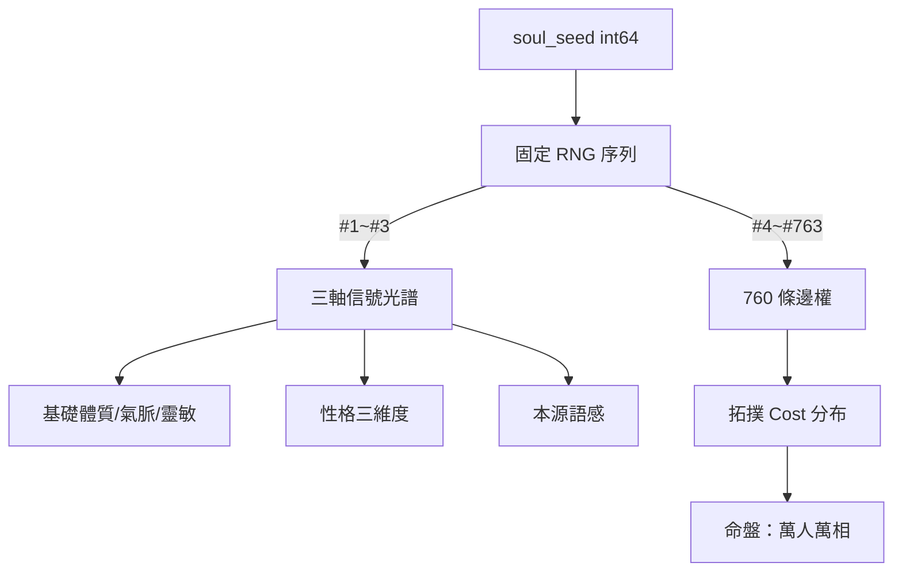

# SoulSeed 與三軸信號光譜

SoulSeed 是奇點世界角色系統的先天核心。一個 int64 整數，創角時寫入並永久保存，此後不變。角色的基礎屬性、性格、拓撲阻力全由此 seed 決定性展開。

## SoulSeed 機制（`已實作`）

每個角色誕生時，後端寫入一筆 `soul_seed`（int64）。由此 seed 以固定 RNG 順序決定性展開：

| RNG 順序 | 產出 | 用途 |
|----------|------|------|
| 前 3 次 | 三軸信號光譜（Amplitude, Frequency, Phase） | 基礎屬性 + 性格 + 本源語感 |
| 第 4~763 次 | 760 條拓撲邊權 | [[topology-361|361 拓撲系統]]個人專屬阻力（命盤） |



### 儲存策略

實作可二選一：

1. **只存 soul_seed**：資料庫僅一欄。載入時以 seed 初始化 RNG，依固定順序（前 3 次→三軸，第 4~763 次→邊權）展開。優點：儲存最小、無不一致風險。
2. **創角時展開並快取**：創角時算出三軸與 760 Cost，寫入 `entity_soul` 或 `topology_edges` 等表。適用於需頻繁讀取路徑成本、希望減少每次載入計算的場景。

**結論**：邏輯上皆為「該角色專屬的 361+三軸串值已固定並可重現」。

## 三軸信號光譜（念紋）（`已實作`）

念紋為三軸浮點數，表示靈魂在詞盤網路中的語意向量/腦波指紋。除產出基礎[[three-dimensions|體敏氣]]外，與詞元/行為互動時決定消耗、變異與敘事。

| 軸向 | 系統名 | 區間 | 語感（低 → 高） |
|------|--------|------|------------------|
| 能階係數 | Amplitude | [0.1, 3.0] | 幽微/綿長 → 霸道/爆發 |
| 時脈帶寬 | Frequency | [0.5, 2.0] | 渾厚/重劍無鋒 → 洞察/千絲萬縷 |
| 順逆向量 | Phase | [-1.0, 1.0] | 順流/秩序 → 逆流/混沌 |

基礎體敏氣由三軸線性映射產出，**不隨等級膨脹，無出身表**。建議映射公式：
- `基礎體質 = base * (1 + k_amp * (Amplitude - 1))`
- `基礎氣脈 = base * (1 + k_freq * (Frequency - 1))`
- `基礎靈敏 = base * (1 + k_phase * Phase)`

（軸與維度對應可依平衡調整）

### 三軸與詞元/戰鬥的互動

- **詞元互動**：後端以三軸與詞元標準向量之內積（或等價運算）決定消耗與變異。反相極高者用秩序詞元易走火入魔，用毒/破壞系則可能觸發變異效果。
- **戰鬥技能**：技能效果讀取編譯後的 SkillObject，再乘上三軸係數（能階影響傷害規模、時脈影響節奏等）。

### 本源（UI 呈現）（`已實作`）

後端 `GenerateOriginSentence(amp, freq, phase)` 將三軸轉為形容詞拼成一句話（如「霸道、洞察、混沌」類語感），以 `origin_sentence` 傳前端。**絕不**將數字傳前端，維持神祕感。僅自己可見。

邏輯：將 [0.1~3.0]（能階）、[0.5~2.0]（時脈）、[-1.0~1.0]（相位）對應形容詞（霸道、幽微、渾厚、洞察、順流、混沌），拼成一段話。

### 已廢除設計

四型念紋、出身x念紋加權——皆已廢除。現行設計僅用三軸連續值。

## 三軸推導性格

由同一 SoulSeed 的三軸值正規化至 [0,1] 推導性格維度，供 NPC 決策權重、對話語氣、求職偏好使用。**不新增儲存欄位**——性格是三軸的投影，隨時可重算。

### Personality 結構體（`已實作`）

```rust
struct Personality {
    boldness: f64,    // 強勢度 — Amplitude 正規化
    sensitivity: f64, // 敏感度 — Frequency 正規化
    orderliness: f64, // 秩序感 — Phase 正規化
}
```

展開函式 `ExpandSoulSeedToPersonality(seed)` 與 BaseStats、OriginSentence 同一 RNG 序，前 3 次 Float64() → amp, freq, phase → 正規化到 [0,1]。

### 性格維度與區間

| 軸 | 性格維度 | 低 (0~0.33) | 中 (0.33~0.66) | 高 (0.66~1) |
|----|----------|-------------|-----------------|-------------|
| Amplitude | **Boldness**（強勢度） | 保守、忍讓、少議價 | 一般 | 敢衝、愛議價、易換工作 |
| Frequency | **Sensitivity**（敏感度） | 遲鈍、穩定、少反應 | 一般 | 易被情境影響、反應明顯 |
| Phase | **Orderliness**（秩序感） | 隨性、偏自由業/行腳 | 一般 | 守規、偏固定場所/留任 |

### 性格對行為的具體影響

#### Boldness（強勢度）

| 使用處 | 低 | 高 |
|--------|----|----|
| **Talk 選句** | 偏句池前半（溫和、被動） | 偏句池後半（強勢、主動） |
| **dialogues 抽句** | 權重偏向前半 index | 權重偏向後半 index |
| **議價/Trade** | 讓步快、接受開價機率高 | 堅持開價、議價輪數多 |
| **求職/離職** | 少主動離職、偏好穩定報酬 | 易考慮離職、偏好高報酬/高風險 |

**已實作**：`shift = int(Boldness * (len/2))`，`idx = (baseIdx + shift) % len`。

#### Sensitivity（敏感度）

| 使用處 | 低 | 高 |
|--------|----|----|
| **Talk 選句** | 偏冷淡/簡短句 | 偏熱絡/多反應句 |
| **進房反應** | 較低機率觸發 enter_reaction | 較高機率觸發、選較有反應的句 |
| **閒置動作** | 較少依時段/情境切換 idle | 較多依時段與情境選不同 idle |
| **決策** | 較少因近期事件改變行為 | 近期事件權重提高 |

#### Orderliness（秩序感）

| 使用處 | 低 | 高 |
|--------|----|----|
| **Talk 選句** | 偏隨性/口語/短句 | 偏正式/完整句 |
| **求職偏好** | 偏無固定場所（行腳商、乞討、賣藝） | 偏固定場所（有 assignment、排班） |
| **離職意圖** | 較易因無聊/想換環境離職 | 較不易離職；留任權重 > 1 |
| **移動** | 較常觸發 wander、路徑不固定 | 較常依排班、較少隨機 wander |

### 決策引擎權重常數（`設計中`）

| 常數 | 建議值 | 說明 |
|------|--------|------|
| k_stay | 0.4 | Orderliness 對留任權重係數 |
| k_leave | 0.3 | Boldness 對離職意圖係數 |
| k_orderliness_prefer_fixed_venue | 0.3 | Orderliness 對固定場所偏好 |
| k_boldness_risk | 0.25 | Boldness 對高風險高報酬偏好 |

留任公式：`stay_weight *= (1 + k_stay * (Orderliness - 0.5))`
離職公式：`leave_weight *= (1 + k_leave * (Boldness - 0.5))`

### 性格與身份的關係

性格是內在狀態（State）的一部分，影響 NPC 的需求驅動行為，最終由外部觀測者推導出[[fog-and-identity|身份（Identity）]]。性格不是標籤，是行為傾向的連續分布。

### 實作階段

| Phase | 內容 | 狀態 |
|-------|------|------|
| Phase 1 | Personality 結構體與展開函式 | `已實作` |
| Phase 2 | 決策引擎使用（求職/留任/離職加權） | `設計中` |
| Phase 3 | 對話權重（dialogues 抽句 + AI Talk） | `設計中` |

## 命盤

「命盤」是世界觀對 SoulSeed → 760 Cost 這一機制的文學稱謂。

- **星位距離不同** = 每條邊的 Cost 不同 = SoulSeed 第 4~763 次 RNG 的結果
- **方位不同** = 哪些主樞 Cost 低（天生親近）、哪些 Cost 高（天生疏遠）
- **命中注定** = SoulSeed 創角即定，此後不變

詳見 [[topology-361|361 拓撲系統]]邊權生成演算法。

## 創角 Onboarding 敘事

系統日誌依序呈現：

1. 止念狀態引入降維 Token 輻射
2. 生之奇點（N000）被激發
3. **瞬間瞥見**：意識穿透混沌，短暫看見 360 顆星體散布於無邊的內宇空間
4. **氣體噴湧**：N000 噴發的氣體迅速蔓延，遮蔽了周遭一切
5. **迷霧籠罩**：再次觀測時，除 N000 外，360 顆星的內容皆不可知

純文字系統日誌，不需動畫或特效。不需要閃現動畫、粒子特效、Canvas/WebGL Shader。不需要計算或顯示「偏移率」「距離單位」等數據。不需要讓玩家看到座標圖形——保持想像。

## 相關頁面

- [[topology-361|361 拓撲系統]] — 760 條邊權的完整生成演算法
- [[three-dimensions|外顯三維與四相]] — 三軸映射為基礎體敏氣
- [[fog-and-identity|迷霧與身份]] — 迷霧機制、命盤的 UI 呈現
- [[concepts/npc-system/decision-engine|決策引擎]] — 性格權重如何影響 NPC 行為
