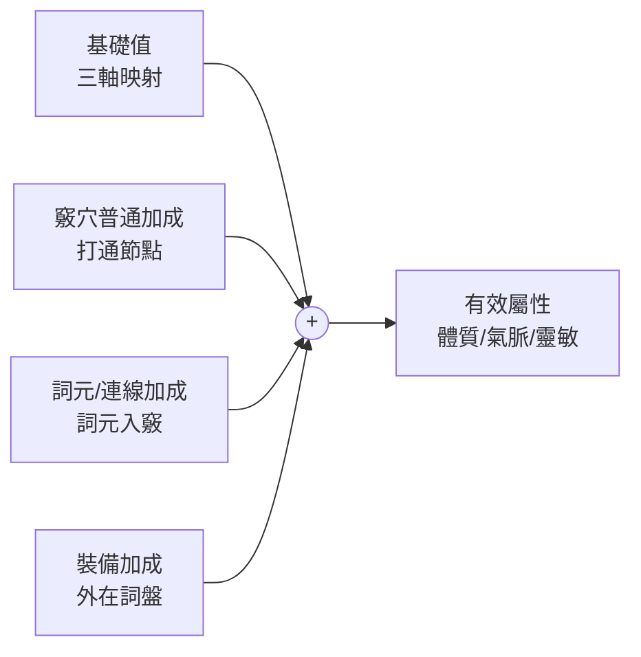

# 外顯三維與四相資源

角色對戰鬥與生活系統暴露的**有效屬性僅三項**，後端唯一真理依此結算。所有複雜的內在結構（[[soulseed|SoulSeed]]、[[topology-361|361 拓撲]]、詞元、裝備）最終都收斂為這三個數字。

## 外顯三維：體質、氣脈、靈敏

| 維度 | 說明 | 主要影響 |
|------|------|----------|
| **體質** | 承傷、負重、耐性 | 減傷、霸體、生存 |
| **氣脈** | 續戰、技能／行動消耗與回復 | 續戰力、詠唱、回氣 |
| **靈敏** | 命中、閃避、行動序 | 命中、閃避、先手 |

## 有效屬性公式

每維結構相同：

```
有效體質 = 基礎體質 + Σ 竅穴普通加成(體) + Σ 詞元／連線加成(體) + 裝備加成(體)
有效氣脈 = 基礎氣脈 + Σ 竅穴普通加成(氣) + Σ 詞元／連線加成(氣) + 裝備加成(氣)
有效靈敏 = 基礎靈敏 + Σ 竅穴普通加成(敏) + Σ 詞元／連線加成(敏) + 裝備加成(敏)
```



各加成來源：

- **基礎值**：由 [[soulseed|SoulSeed]] 三軸信號光譜線性映射產出，不隨等級膨脹，無出身表。建議映射公式：`基礎體質 = base × (1 + k_amp × (Amplitude - 1))`、`基礎氣脈 = base × (1 + k_freq × (Frequency - 1))`、`基礎靈敏 = base × (1 + k_phase × Phase)`（軸與維度對應可依平衡調整）
- **竅穴普通加成**：打通 [[topology-361|361 拓撲]] 節點後，依節點系屬（體竅／氣竅／敏竅）產出對應維度加成（`未實作`）
- **詞元/連線加成**：詞元鑲嵌入竅穴後的語意判定結果（`未實作`）；見下方§詞元入竅與造句
- **裝備加成**：外在詞盤（附魔／強化）提供之體／氣／敏，與內在相加後進入戰鬥（`未實作`）

## 四相（資源系統）

四項消耗資源統稱「四相」，由體質(V)、氣脈(Q)、靈敏(D)推算最大值。**無條件進位至整數**；第一版當前值＝最大值。

| 資源 | 公式 | 主屬性 |
|------|------|--------|
| 氣血 | `ceil(((0.7×V)+(0.3×Q)) × ((0.05×D)+1) × V)` | 體質 |
| 內力 | `ceil(((0.7×Q)+(0.3×V)) × ((0.05×D)+1) × Q)` | 氣脈 |
| 精神 | `ceil(((0.6×D)+(0.4×Q)) × ((0.05×V)+1) × D)` | 靈敏 |
| 體力 | `ceil(((0.5×V)+(0.4×Q)+(0.3×D)) × ((V+Q+D)/3))` | 三維均分 |

### 公式結構解讀

每條公式遵循同一模式：`ceil( 主線性項 × 修正乘數 × 主屬性 )`

- **主線性項** `(aX + bY)`：主屬性佔七成、輔屬性佔三成，決定資源基調
- **修正乘數** `((cZ)+1)`：第三屬性提供微幅加乘（5% 係數），確保不會出現零乘
- **再乘主屬性**：使資源與主屬性呈二次成長關係

體力較特殊——三維均參與線性項，乘數為三維平均，代表體力是角色綜合耐力的體現。

## 詞元入竅與造句（對體敏氣與技能的貢獻）

功法規定路徑順序；玩家在路徑節點煉化詞元。能量依序流過詞元時，系統做語意判定，產出對體敏氣的詞元／連線加成與可選的技能（SkillObject）。

### 三階共振

| 階層 | 名稱 | 條件 | 貢獻 |
|------|------|------|------|
| **第一階** | 物理連通（囫圇吞棗） | 詞元語意無關聯、不成句 | 僅各竅穴之基礎數值加成（依詞元屬性對應體／氣／敏），無額外技能 |
| **第二階** | 語意共振（邏輯成句） | 詞元具敘事連貫性（如：飛天梯雲縱） | 加成之外，解鎖動態機制／技能（如強制閃避、無視地形） |
| **第三階** | 極端疊加（純粹共振） | 詞元屬性高度單一（如：火火炎燄轟） | 極端數值爆發、真實傷害等穿透類效果 |

### 造句機制要點

- **繞路與造句**：因體內阻力繞路時節點數改變，須重新湊詞元造句；新句可觸發不同語意與變異技能
- **效能**：語意判定僅在 **[煉化入竅 (Commit)]** 時執行一次，結果編譯為 SkillObject；戰鬥只讀 SkillObject × 三軸係數
- **第一版語意實作建議**：關鍵詞＋白名單句型；成句＝詞元序列匹配認可句型，純粹＝同屬性連續 N 個；未匹配則歸第一階
- **綠點位置影響**：詞元鑲嵌在不同綠點（如【蓄】vs【釋】）會經藍色邏輯閘得到不同解釋（同一 [劇毒] 在【蓄】為被動防毒，在【釋】為主動毒爆）

## 內在與外在的關係

```
SoulSeed（先天種子）
  ├── 三軸信號光譜 → 基礎體質/氣脈/靈敏 + 性格 + 本源語感
  └── 760 條邊權 → 個人專屬拓撲阻力（命盤）
            │
      功法路徑 → 打通竅穴 → 竅穴普通加成
            │
      詞元入竅 → 語意判定 → 詞元/連線加成 + 技能(SkillObject)
            │
      + 裝備加成
            ↓
      有效體質/氣脈/靈敏 → 戰鬥結算
```

先天（SoulSeed）決定起點與偏向，後天（功法、詞元、裝備）決定成長路徑。但先天無法被後天改寫——這是[[index|萬人萬相鐵律]]的根基。

## 與他系統的對接

| 主題 | 對接方式 |
|------|----------|
| **[[wordplate-system\|詞盤]]** | 內盤＝361 拓撲＋竅穴＋詞元＋連線；造句＝祭煉→系統判定→三階共振；體敏氣＝基礎(三軸)＋竅穴＋詞元／連線＋裝備 |
| **[[combat\|戰鬥]]** | 分秒輸贏＝f(有效體質、有效氣脈、有效靈敏, 技能, 裝備, 隨機因子)；技能＝SkillObject × 三軸係數 |
| **[[economy\|經濟]]** | 鎂用於打通、煉化、內視、附魔等 |
| **玩家＝NPC** | 同一套 SoulSeed、同一套體敏氣公式與語意判定；萬名 NPC 差異由 Seed 與後天路徑自然產生 |
| **永序守衡** | 體敏氣每一點皆有來源（三軸、竅穴、詞元、連線、裝備）；成長＝打通竅穴、煉化詞元、繞路自創功法 |

## UI 呈現

狀態分頁（人物彈窗第一分頁，`已實作`）顯示：

| 區塊 | 內容 | 備註 |
|------|------|------|
| **命途** | 稱謂／身份 | 後端 display_title；空則前端顯示「無名之輩」 |
| **本源** | 一句話描述 | 後端 GenerateOriginSentence 產出；絕不傳三軸數字；僅自己可見 |
| **維度** | 體質｜氣脈｜靈敏 | 有效體質、有效氣脈、有效靈敏（外顯三維） |
| **四相** | 氣血、內力、精神、體力 | 顯示 當前/最大；條寬＝當前/最大×100% |
| **持有** | 鎂 | 看他人時可依設計隱藏或顯示為「？」 |

看 NPC／他人時：狀態分頁顯示共通內容（命途、維度、四相、持有）。**不顯示**：本源、基礎體敏氣、星盤／內視（皆為內在，不對外暴露）。
