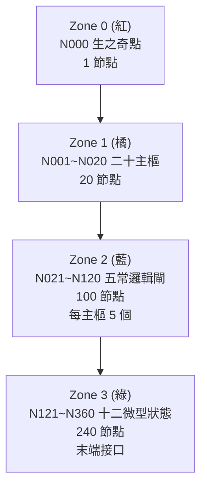
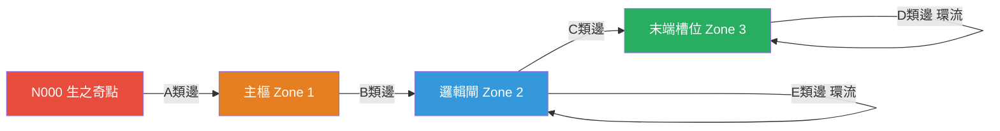

# 361 拓撲系統

人體為 361 節點的拓撲網格。連線規則（誰連誰）全服一致（**萬人一相**）；每條連線的阻力（Cost）由 [[soulseed|SoulSeed]] 決定性生成（**萬人萬相**）。

## 設計原則

- **節點總數**：1 + 20 + 100 + 240 = **361**。N000 生之奇點為唯一起點，不屬任何系；其餘 360 節點收斂為體系、氣系、敏系
- **萬人一相**：誰連誰（連線規則）由全域靜態配置決定，全服一致
- **萬人萬相**：每條連線的阻力 (Cost) 由角色之 SoulSeed 決定性生成；總阻力守恆，無絕對廢柴或天才，只有偏科
- **創角即定**：角色誕生時後端必存 `soul_seed`（int64），由此 seed 決定性產出三軸信號光譜（前 3 次 RNG）與 760 條邊權（第 4~763 次 RNG）
- **世界觀**：能量自生之奇點暴脹，噴湧出 20 道高能電漿流接入主樞，再經邏輯閘至末端接口，於綠點與世界互動（煉化詞元、造句、釋放技能）

## 四區分層結構

| 區域 | 節點數 | 代碼範圍 | 概念 |
|------|--------|----------|------|
| **Zone 0** (紅) | 1 | N000 | **生之奇點**：靈魂降臨的唯一起點，預設貫通 |
| **Zone 1** (橘) | 20 | N001~N020 | **二十主樞**：接收電漿流的處理核心 |
| **Zone 2** (藍) | 100 | N021~N120 | **五常邏輯閘**：每主樞 5 個（起/承/轉/協/合） |
| **Zone 3** (綠) | 240 | N121~N360 | **十二微型狀態**：末端接口，煉化詞元的實體槽位 |

**縱向關係**：紅 → 橘 1:20；橘 → 藍 1:5；藍 → 綠 依 3:2 陣列咬合。

### 主樞與藍、綠節點之對應公式

主樞編號 i（i = 1~20，對應 N001~N020），所轄節點代碼唯一確定（萬人一相）：

| 層級 | 節點代碼範圍 | 公式 |
|------|--------------|------|
| 主樞 i | N00i（橘） | i = 1~20 |
| 該主樞下 5 藍 | N(20+5(i-1)+1) ~ N(20+5i) | 如 i=1: N021~N025 |
| 該主樞下 12 綠 | N(120+12(i-1)+1) ~ N(120+12i) | 如 i=1: N121~N132 |

每個主樞的系屬（體/氣/敏）一經指定，其下 5 藍、12 綠之系屬與之相同。

## 系屬收斂與節點代碼一覽

N000 無系屬。其餘 360 節點依所屬主樞收斂為三系，對應[[three-dimensions|外顯三維]]。

### 二十主樞系屬對照表

| 代碼 | 名稱 | 系屬 | 外顯維度 |
|------|------|------|----------|
| N001 | 天極 | **體** | 體質 |
| N002 | 脈衝 | 敏 | 靈敏 |
| N003 | 震淵 | **體** | 體質 |
| N004 | 游離 | 敏 | 靈敏 |
| N005 | 弦絲 | 敏 | 靈敏 |
| N006 | 曜核 | 氣 | 氣脈 |
| N007 | 凜晶 | 氣 | 氣脈 |
| N008 | 淵流 | 氣 | 氣脈 |
| N009 | 萬象 | 氣 | 氣脈 |
| N010 | 解離 | 氣 | 氣脈 |
| N011 | 鎮閾 | **體** | 體質 |
| N012 | 衡定 | 氣 | 氣脈 |
| N013 | 穹壁 | **體** | 體質 |
| N014 | 重塑 | **體** | 體質 |
| N015 | 逆熵 | 氣 | 氣脈 |
| N016 | 神淵 | 氣 | 氣脈 |
| N017 | 識閾 | 敏 | 靈敏 |
| N018 | 坍縮 | 氣 | 氣脈 |
| N019 | 無相 | 敏 | 靈敏 |
| N020 | 越權 | 敏 | 靈敏 |

**小計**：體系 5 主樞、氣系 9 主樞、敏系 6 主樞。

### 三系節點代碼一覽

**體系（體質）** — 5 主樞 → 25 藍 → 60 綠，共 90 節點

| 主樞 | 邏輯閘（藍） | 末端（綠） |
|------|--------------|------------|
| N001 天極 | N021~N025 | N121~N132 |
| N003 震淵 | N031~N035 | N145~N156 |
| N011 鎮閾 | N071~N075 | N241~N252 |
| N013 穹壁 | N081~N085 | N265~N276 |
| N014 重塑 | N086~N090 | N277~N288 |

**氣系（氣脈）** — 9 主樞 → 45 藍 → 108 綠，共 162 節點

| 主樞 | 邏輯閘（藍） | 末端（綠） |
|------|--------------|------------|
| N006 曜核 | N046~N050 | N181~N192 |
| N007 凜晶 | N051~N055 | N193~N204 |
| N008 淵流 | N056~N060 | N205~N216 |
| N009 萬象 | N061~N065 | N217~N228 |
| N010 解離 | N066~N070 | N229~N240 |
| N012 衡定 | N076~N080 | N253~N264 |
| N015 逆熵 | N091~N095 | N289~N300 |
| N016 神淵 | N096~N100 | N301~N312 |
| N018 坍縮 | N106~N110 | N325~N336 |

**敏系（靈敏）** — 6 主樞 → 30 藍 → 72 綠，共 108 節點

| 主樞 | 邏輯閘（藍） | 末端（綠） |
|------|--------------|------------|
| N002 脈衝 | N026~N030 | N133~N144 |
| N004 游離 | N036~N040 | N157~N168 |
| N005 弦絲 | N041~N045 | N169~N180 |
| N017 識閾 | N101~N105 | N313~N324 |
| N019 無相 | N111~N115 | N337~N348 |
| N020 越權 | N116~N120 | N349~N360 |

**校核**：90 + 162 + 108 = 360；N000 不計入系屬。

### 系屬判定公式（實作用）

- N000：無系屬（生之奇點）
- N001~N020：直接查系屬對照表
- N021~N120（藍）：主樞編號 `i = floor((node_id - 21) / 5) + 1`，再查該主樞系屬
- N121~N360（綠）：主樞編號 `i = floor((node_id - 121) / 12) + 1`，再查該主樞系屬

後端僅需維護 20 筆主樞系屬表，其餘由公式推得。

## 二十主樞四大陣列

20 個橘色節點依功能分為 4 大陣列。在不同主樞下造句，同一句型可產生不同加成與特效。

### 動能與輸出陣列 (Kinetic / Output)

| 代碼 | 名稱 | 核心編譯權重 | 造句共振傾向 |
|------|------|--------------|--------------|
| N001 | 天極 (Zenith) | 絕對力量爆發、最暴力單發傷害 | 重擊、真實物理傷害、擊飛 |
| N002 | 脈衝 (Pulse) | 攻擊頻率與瞬間加速 | 連擊、攻速增幅、殘影 |
| N003 | 震淵 (Seismic) | 低頻震盪、裝甲破壞 | 破甲、震退、內傷流血 |
| N004 | 游離 (Ionized) | 無軌跡位移與動能卸載 | 閃避、瞬移、卸力 |
| N005 | 弦絲 (String) | 極微物理切割與精密控制 | 暴擊率、要害判定、流血 |

### 塑能與環境陣列 (Metamorphic)

| 代碼 | 名稱 | 核心編譯權重 | 造句共振傾向 |
|------|------|--------------|--------------|
| N006 | 曜核 (Corona) | 高溫、等離子態、劇烈氧化 | 焚燒、爆炸、範圍高熱 |
| N007 | 凜晶 (Cryo-core) | 熱力學奪取、絕對靜止 | 冰凍、減速、封印 |
| N008 | 淵流 (Abyss Flow) | 流體承載、毒素循環 | 劇毒、腐蝕、環境同化 |
| N009 | 萬象 (Omni) | 氣象交織、氣壓與高能電荷 | 麻痺、牽引、範圍干擾 |
| N010 | 解離 (Dissociate) | 物質底層分解 | 消除增益、裝備破壞、分解 |

### 維穩與容錯陣列 (Stability / Aegis)

| 代碼 | 名稱 | 核心編譯權重 | 造句共振傾向 |
|------|------|--------------|--------------|
| N011 | 鎮閾 (Threshold) | 傷害吸收閾值 | 減傷、霸體、硬直抵抗 |
| N012 | 衡定 (Equilibrium) | 氣脈與血量被動恢復 | 被動回血、氣脈回復、耐久 |
| N013 | 穹壁 (Vault) | 主動屏障與能量護盾 | 護盾生成、反彈、陣地防禦 |
| N014 | 重塑 (Reconstruct) | 斷肢重生與系統修復 | 瞬間治療、斷肢接合、復活 |
| N015 | 逆熵 (Negentropy) | 清除負面狀態 | 解控、異常免疫、淨化 |

### 特權與覆寫陣列 (Override)

| 代碼 | 名稱 | 核心編譯權重 | 造句共振傾向 |
|------|------|--------------|--------------|
| N016 | 神淵 (Divine Abyss) | 靈魂與神識攻擊 | 精神傷害、混亂、控制 |
| N017 | 識閾 (Cognitive) | 數據讀取與幻覺植入 | 破綻洞察、致盲、幻象 |
| N018 | 坍縮 (Collapse) | 空間引力與質量干涉 | 強制位移、聚怪、重壓 |
| N019 | 無相 (Formless) | 消除自身觀測狀態 | 隱身、無法被選定、仇恨清除 |
| N020 | 越權 (Override) | 凌駕常規法則的代碼覆寫 | 斬殺判定、規則無視、時光回溯 |

## 五常邏輯閘（藍區）

每主樞下 5 個藍點決定能量流轉的性質變換，**不存詞元**：

| 邏輯閘 | 功能 | 語意編譯作用 |
|--------|------|--------------|
| **起** Initiate | 指令握手 | 接收主樞電漿流，判定技能意圖與初步指向 |
| **承** Buffer | 能量緩衝 | 穩定流速，決定持續時間與穩定度 |
| **轉** Transform | 語意編譯 | 將煉化詞元轉譯為法則，決定變異方向 |
| **協** Coordinate | 路徑塑型 | 整合多重詞元，決定技能形狀與影響範圍 |
| **合** Commit | 執行觸發 | 最終輸出判定：暴擊、穿透、最終威力 |

> **轉與協之間為絕對斷點**：輸入編譯段與輸出執行段在縱向上無直接連線，須經造句邏輯或橫向跳線跨越。

## 十二微型狀態（綠區）

綠點為煉化詞元的實體槽位。詞元鑲嵌在不同綠點（如「蓄」vs「釋」）會經藍色邏輯閘得到不同解釋（例：同一 `[劇毒]` 在【蓄】為被動防毒，在【釋】為主動毒爆）。

**輸入段**（起/承/轉管理，7 接口）：

| 代碼 | 名稱 | 功能 |
|------|------|------|
| G01 | **探** Probe | 感測；影響索敵距離與優先度 |
| G02 | **觸** Touch | 接觸；影響命中率與接觸判定 |
| G03 | **納** Intake | **(共用點)** 吸納能量；詞元在此增加續航力 |
| G04 | **蓄** Store | 儲存；影響威力上限與充能 |
| G05 | **濾** Filter | **(共用點)** 提純；影響抗干擾與純粹傷害 |
| G06 | **析** Analyze | 拆解；影響破甲與弱點偵測 |
| G07 | **融** Merge | 融合；詞元在此易觸發多屬性融合變異 |

**絕對斷點**：G07 與 G08 之間無縱向連線。能量須透過造句邏輯或同層橫向跳線跨越。

**輸出段**（協/合管理，5 接口）：

| 代碼 | 名稱 | 功能 |
|------|------|------|
| G08 | **衍** Derive | 衍生；決定後續效果或連鎖反應 |
| G09 | **律** Regulate | 規律；影響攻擊節奏與冷卻縮減 |
| G10 | **束** Focus | **(共用點)** 收束；極大化單點破壞力 |
| G11 | **釋** Release | 釋放；決定瞬間爆發力與射程 |
| G12 | **散** Radiate | 餘震；影響範圍傷害與環境同化 |

**3:2 陣列咬合**：前三藍（起/承/轉）共兩綠（納 G03、濾 G05）為輸入段共用點；後二藍（協/合）共一綠（束 G10）為輸出段共用點。相鄰兩藍組在綠點上不重疊，形成清晰斷點與繞路策略。

### 藍→綠連線具體對應（每主樞 15 條，型 C 邊）

主樞 i 之 5 藍為 B1~B5，12 綠為 G1~G12：

- B1(起) → G01(探), G02(觸), G03(納)
- B2(承) → G03(納), G04(蓄), G05(濾)
- B3(轉) → G05(濾), G06(析), G07(融)
- B4(協) → G08(衍), G09(律), G10(束)
- B5(合) → G10(束), G11(釋), G12(散)

## 連線與邊權

共 **760 條邊**，分五類：

| 類型 | 連線方向 | 數量 | 列舉規則 |
|------|----------|------|----------|
| A | 紅→橘（N000→主樞） | 20 | i=1..20 依升序 |
| B | 橘→藍（主樞→邏輯閘） | 100 | i 升序，再 j=1..5 升序 |
| C | 藍→綠（邏輯閘→末端） | 300 | i 升序，每 i 內 j 升序，每 j 3 條 |
| D | 綠同層環（末端內環流） | 240 | 每主樞 12 綠成環，i 升序 |
| E | 藍同層環（邏輯閘內環流） | 100 | 每主樞 5 藍成環，i 升序 |

**邊序總覽**：e1~e20 型 A，e21~e120 型 B，e121~e420 型 C，e421~e660 型 D，e661~e760 型 E。RNG 依此固定序抽取。

### 邊權生成演算法（歸一化分配）（`已實作`）

**常數**（規格定案）：

| 常數 | 值 | 說明 |
|------|----|------|
| CONST_TOTAL_TOPOLOGY_COST | 10000 | 全圖 Cost 總和恆等 |
| M（邊數） | 760 | 五類邊之總數 |
| RAW_WEIGHT_MIN | 0.1 | 原始權重下限 |
| RAW_WEIGHT_MAX | 1.0 | 原始權重上限 |

**步驟**：

1. **初始化 RNG**：以 `soul_seed` 為種子建立決定性亂數產生器。前 3 次已用於三軸光譜，邊權從**第 4 次**起。
2. **抽取原始權重**：對 k=1..760，r_k = 0.1 + 0.9 * U_k（U_k 為 [0,1) 均勻亂數），故 r_k 在 [0.1, 1.0]。
3. **計算總和**：S = sum(r_k)，S 在 [76, 760] 之間。
4. **歸一化**：Cost(e_k) = (r_k / S) * 10000。
5. **驗證**：sum(Cost) = 10000。浮點誤差可將殘差攤入最後一條邊。

**全域平均 Cost** 約 10000 / 760 = 13.16。

**約定**：同一 SoulSeed 在以上邊序下，必須得到相同的一組 Cost，以利重現與除錯。

### Cost 文字化（通暢度標籤）（`已實作`）

| 等級 | Cost 範圍 | 標籤 | 顏色 | 語意 |
|------|-----------|------|------|------|
| 1 | ≤ 7 | **暢流** | 綠 #67c23a | 極佳通道 |
| 2 | 7~11 | **順通** | 青 #79bbff | 阻力偏低 |
| 3 | 11~16 | **平穩** | 灰 #8b949e | 適中 |
| 4 | 16~21 | **滯澀** | 橙 #e6a23c | 阻力偏高 |
| 5 | > 21 | **險阻** | 紅 #f56c6c | 嚴重受阻 |

**顯示格式**：`<標籤> (XX.XX)` — 標籤以對應色彩渲染，括號內精確值供硬核玩家參考。

**五類邊 UI 呈現**：
- 型 A（主樞列表）：「適性：暢流 (14.73)」
- 型 B（觀測儀藍點）：「─ 順通 (9.28)」
- 型 C（觀測儀綠點）：「─ 滯澀 (18.44)」
- 型 D（綠環）：`⟳→G02 暢流 (5.32)`（較小字體、半透明）
- 型 E（藍環）：`⟳→[承] 暢流 (5.32)`（較小字體、半透明）

## 能量循環

### 微循環（綠點表層）

N000 背景輻射浸潤綠點。僅走綠連綠的功法（爛大街功法）只借用表層能量，不需打通橘藍，僅基礎數值加成（**一階語意**）。

### 大循環（橘→藍→綠）

消耗氣脈/鎂打通橘藍，經主樞加壓與邏輯閘編譯，觸發**二階/三階語意共振**，對應頂級功法。

### N000 預設貫通

- **世界觀**：角色創角即擁有 SoulSeed，靈魂已降臨；存在即暴脹，故無須消耗即為貫通。N000 未點亮 = 無 SoulSeed 或軀體已死。
- **系統**：N000 為拓撲根節點 (Root)，尋路與打通邏輯從此起算。
- **養成曲線**：新手期在綠點間連線與鑲嵌詞元；進階期向內打通藍、橘取得編譯權限。

## 繞路與自創功法

- **綠區**：綠點橫向連線密集，繞路成本低，適合速成功法與平民流派
- **藍區**：策略性同層連線；繞路可能引發語意干涉（變異或走火入魔）
- **橘區**：橘點橫向連線極少，跨橘連線 Cost 極高，對應傳說級或禁忌功法

功法優劣由「下潛深度」（是否觸及橘、紅）與「佔用節點數」決定；同一本功法在不同 SoulSeed 下路徑/造句長度不同 = **萬人萬功法**。

### 頂級功法：雙軌定義

| 維度 | 說明 |
|------|------|
| **功法等級（靜態/全服）** | 設計定義的潛力上限：下潛深度、路徑節點數、造句槽位數、可達成語意階層（一/二/三階） |
| **對你而言是否頂級（動態/個人）** | 你的 SoulSeed 下：路徑總 Cost 是否可負擔、貫通率、三軸語意匹配度 |

**貫通率**：該角色拓撲下，沿某功法路徑已打通節點數/路徑總節點數。量化「這本功法對你多頂級」。

**師承定位**：師承優點在教導與經驗傳承（心法、讀圖、繞路經驗），而非傳授「唯一真經」。同一本經書每人 Cost 不同，煉不煉得成在個人。**青出於藍更勝於藍** = 弟子在自己的拓撲下走出自己的路。

## 星盤（UI 層）（`部分已實作`）

星盤為 361 竅穴網路的前端層級式呈現（第四分頁）。代碼邏輯層用 **InnerPlate**（內盤），UI 層用**星盤**。

區塊結構：
1. **宏觀進度**：星盤貫通率（已貫通/360）、N000 生之奇點（已點亮）
2. **二十主樞目錄**（可摺疊）：依四大陣列分組，每項顯示貫通進度、適性、操作按鈕
3. **觀測儀**（展開後）：樹狀顯示 5 藍 + 12 綠，綁定 Topology Cost

詳見 [[fog-and-identity|迷霧機制]] 的前端渲染規則。

## 相關頁面

- [[soulseed|SoulSeed 與三軸信號光譜]] — seed 展開為三軸與 760 邊權
- [[three-dimensions|外顯三維與四相資源]] — 361 系屬收斂為體/氣/敏
- [[fog-and-identity|迷霧與身份]] — 迷霧機制控制玩家對拓撲的認知進程
- [[concepts/wordplate-system/index|詞盤系統]] — 詞元入竅、造句與 361 節點的交互
