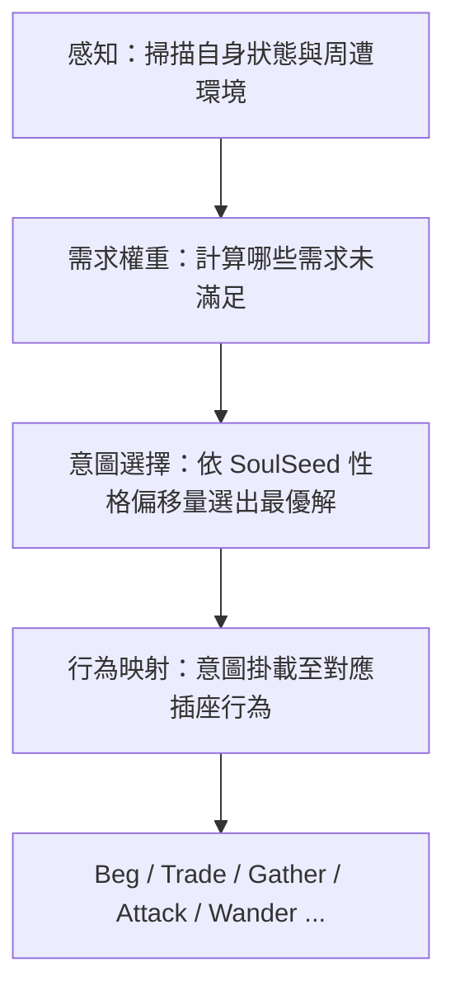

# 決策引擎（The Brain）

決策引擎是將「內在需求（Maslow）」轉化為「具體行為（Actions/Sockets）」的邏輯中樞。它回答兩個問題：**NPC 現在為什麼要做這件事？** 以及 **在多個選擇中，為什麼選這一個？**

---

## 三層結構

| 層 | 名稱 | 功能 |
|---|------|------|
| **第一層** | 需求掃描器 | 每 tick 依馬斯洛層級計算各層的緊迫度分數（0.0–1.0） |
| **第二層** | 性格偏移處理 | 當多個需求同時觸發時，[[soulseed|SoulSeed]] 三軸性格決定選擇偏好 |
| **第三層** | 世界情境匹配 | 意圖結合場所屬性（Room Tags）落地為具體行為 |



### 第一層：需求掃描器

引擎每隔固定 Tick 對 NPC 掃描，依馬斯洛層級計算各層的「緊迫度」分數（0.0 ~ 1.0）：

| 層級 | 偵測指標 | 緊迫度計算 |
|------|----------|-----------|
| **1. 生存** | `Magnesium` | `clamp(1.0 - (current_mg / survival_line), 0, 1)` |
| **2. 安定** | `AssignmentID` | `has_assignment ? 0 : 0.8`（無職者有高度不安感） |
| **3. 社交** | `LastTalkAt` | `clamp((now - last_talk) / social_decay, 0, 1)` |
| **4. 尊重** | `EqValue` / `JobRank` | `ambition_score * (target_rank - current_rank)`（V2 再定義） |
| **5. 實現** | soul_seed／長期目標旗標 | V3／完整版再接入 |

### 第二層：性格偏移處理

當多個層級的緊迫度同時觸發時，NPC 的 **SoulSeed 三軸性格**決定選擇偏好：

| 軸 | 高值偏向 | 低值偏向 |
|---|---------|---------|
| **大膽度（Boldness）** | 高風險行為（荒野狩獵、向強者搭訕） | 下求行為（乞討、打零工、安全區徘徊） |
| **敏感度（Sensitivity）** | 社交需求觸發快，傾向人煙稠密處 | 能忍受孤獨與惡劣環境，行為更具目的性 |
| **秩序感（Orderliness）** | 極度渴望正式職位 | 隨遇而安，偏向採集、拾荒等自由方式 |

### 第三層：世界情境匹配

意圖結合**場所屬性 (Room Tags)** 落地為行為：

- **意圖：求生** + **場所：Gate/Social** → 執行 `Beg`（乞討）
- **意圖：求生** + **場所：Wilderness** → 執行 `Gather`（拾荒）
- **意圖：安定** + **場所：Venue(有空缺)** → 執行求職流程
- **意圖：社交** + **場所：Tavern/Social** → 執行 Idle 閒置敘事

### 鐵律

- **NPC 永遠不會「無事可做」**。找不到 A 方案就找 B，再不行就乞討、發呆抱怨。行為不需要最優解，只需要有反應。
- **降級鏈**：意圖與場所不匹配時，NPC 不放棄，而是降級到次優行為（例如：想求職 → 附近沒空缺 → 移動到有空缺的區域 → 途中鎂耗盡 → 就地乞討 → 繼續前往求職）。`fallback_intents()` 逐級降級（SeekJob→Beg→Wander）。
- **意圖慣性**：正在執行的意圖享有 1.8x 加權優勢（`decide_with_inertia()`），行為不會每 tick 失憶式擲骰。

---

## 馬斯洛需求層級

奇點世界採用修改版馬斯洛五層需求系統，作為決策引擎的底層依據。

### 五層定義

| 層級 | 名稱 | 滿足條件 | 市井情境 | 湧現身份 |
|------|------|---------|---------|---------|
| **1. 生存** | 溫飽與代謝 | 鎂 > 閾值 | 高能食物維持耀變肉身；肚子餓就要賺錢 | 乞丐、流民、打雜者 |
| **2. 安定** | 職缺與屋簷 | 有至少一筆 assignment | 一份職位意味安穩過日子、有穩定鎂收入的社會槽位 | 夥計、店員、守衛 |
| **3. 社交** | 頻率錨定 | 近期有交談/同房有人 | 本能地需要聚在一起用人聲錨定彼此理智 | 酒客、旅人、街頭閒漢 |
| **4. 尊重** | 支配與有序 | 存款達標、高階裝備、高階指派 | 追求支配混沌的富態物，穿附詞服飾，世俗優越感 | 朝奉、掌櫃、教頭 |
| **5. 實現** | 點火與降維 | 俗世地位已無法滿足 | 主動放棄保護頻率，引導 Token 降維入體 | 隱世高手、修真狂人 |

### 設計要點

- **需求不是「解鎖」的**——不是「吃飽了才想社交」，而是**所有層級同時存在，只是權重隨狀態變化**。
- **[[worldview|聚念場悖論]]**影響需求環境：人多→密度低→資源長得慢但安全；人少→密度高→資源豐富但危險。天然產生分流機制。
- **第一版的根本問題**：只做兩層不代表只需要兩層。即使是最底層的乞丐，也會想跟人說話（社交）、也會羨慕別人穿得好（尊重）。第一版把高層需求完全關閉，導致 NPC 行為只剩「賺錢」和「找工作」，像機器人而非人。

### 聚念場悖論與資源產出

聚念場是有念生物聚集時形成的場，不是地理屬性。此定理直接影響需求系統的環境因子：

- **聚念場弱（人少）**→ 富態化旺盛 → 資源豐富但環境危險 → 高收益高風險
- **聚念場強（人多）**→ 富態化被抑制 → 資源生長慢但安全 → 低收益低風險

因此所有採集/開挖活動存在**最佳人數平衡點**。NPC 的決策不只考慮「哪裡有資源」，還需考慮「那裡有多少人」——天然產生分流機制，避免所有 NPC 擠向同一個資源點。

### 決策優先序

```
1. 生存未滿足（鎂低）？
   ├→ 附近有空缺？ → 求職
   ├→ 背包有貨？ → 賣貨（Trade）
   ├→ 附近可採集？ → 採集（Gather）
   ├→ 在 gate/social 區域？ → 乞討（Beg）
   ├→ 以上都沒有 → 移動到最近可行區域
   └→ 兜底：就地乞討或徘徊
2. 安定未滿足（無職）？ → 求職意圖
3. 皆滿足？ → 閒逛/上班/社交
```

### 僧多粥少（討論 002）

商舖滿招 ≠ 世界沒有謀生手段。無職 NPC 可以：

| 行為 | 說明 | 需要 assignment？ |
|------|------|:----------------:|
| **狩獵** | 到野外擊殺怪物 → 掉落材料或鎂 | 否 |
| **採集** | outdoor/wilderness 房間採資源 | 否 |
| **行腳商** | A 地買 B 地賣賺差價，自己就是移動商舖 | 否 |
| **乞討** | gate/social 房間 Beg | 否 |
| **打零工** | 一次性任務 | 否 |

**身份永遠是結果，不是輸入。** 他做了採集→別人看到他在採集→認知他是採集者。

### 馬斯洛實作階段

| 階段 | 內容 | 狀態 |
|------|------|:----:|
| 第一版 | 生存（鎂消耗 + 閾值）、安定（有無 assignment） | ✅ |
| 進階 | soul_seed 權重偏移、目標堆疊、離職流動 | 🟡 |
| 完整 | 社交/尊重/實現層、長期目標、規劃與記憶 | ⬜ |

---

## 實作階段

| 版本 | 內容 | 狀態 |
|------|------|:----:|
| V1 | 固定邏輯引擎：`if-else` 固定優先序 | ✅ |
| V2 | 意圖評分系統 + 行為連貫性（慣性 1.8x、降級鏈、表面行為觀測 `current_activity`） | ✅ |
| V3 | 長效目標系統：跨周期目標堆疊 | ⬜ |

### Rust 實作現況

| 模組 | 說明 |
|------|------|
| `npc/decision.rs` `decide()` | V1 加權隨機：8 種意圖，三軸人格加權 |
| `DecisionState` / `DecisionContext` | 鎂、指派、性格、心境、背包、房間 tag、周邊場所 |
| `job_matching.rs` | 每 30s 撮合（距離優化配對），與腦分離 |
| `npc_expense.rs` | 每遊戲日扣 8 鎂，驅動生存緊迫度 |
| `traveler.rs` `TravelerManager` | decide() → resolve_brain_path() → 移動 → 到達 → apply_brain_arrival_effects() |
| `brain_arrival.rs` | 到達效果：Beg(+鎂)、Gather(+herb)、SeekJob(+指派)、Trade(+鎂-物品)、Socialize(+心境) |
| `disposition.rs` | 心境系統：事件加減、時段微調（黎明+1、深夜-1） |

### 代碼欠債

| 文檔要求 | 現狀 |
|----------|------|
| 五層需求交織 | 只有生存（鎂）和安定（有無職）；社交只是權重數字，尊重和實現未接 |
| 豐富的經濟循環 | 物品只有 wild_herb |
| 聚念場悖論影響資源產出 | 資源點不存在 |
| 目標堆疊（V3） | 完全未實作 |

### 下一步優先序

| 優先級 | 項目 | 狀態 |
|--------|------|:----:|
| P0 | 行為連貫性（意圖慣性） | ✅ |
| P0 | 降級鏈 | ✅ |
| P0 | 兜底行為有敘事 | ✅ |
| P0 | 表面行為觀測 | ✅ |
| P0 | PostgreSQL 主資料源 | ✅ |
| P1 | 資源點建立 | ⬜ |
| P2 | 物品多樣化 | ⬜ |
| P2 | 社交層真正運作 | ⬜ |
| P3 | 尊重層接入 | ⬜ |
| P3 | 目標堆疊（V3） | ⬜ |

---

## 相關頁面

- [[npc-system/index|NPC 系統總覽]]
- [[npc-system/observation|觀測分級與驅動]]
- [[npc-system/dialogue|對話系統]]
- [[npc-system/memory|記憶系統]]
- [[npc-system/identity-emergence|身份湧現與社交行為]]
- [[character-system|角色系統]] — SoulSeed 三軸性格
