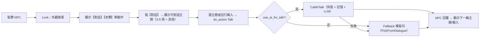

# 對話系統

NPC 對話系統涵蓋玩家與 NPC 的互動、NPC 之間的閒聊、以及模板對話池的組合機制。LLM 為第一優先，模板為降級方案，確保任何情況下 NPC 都能開口。

---

## 玩家 ↔ NPC 對話

### 流程



NPC 回覆後自動顯示下一輪主題/輸入，多輪延續不需重點 NPC。

### 優先序（決策 007）

| 順序 | 條件 | 行為 |
|------|------|------|
| 1 | `use_ai_for_talk` 且 NPC 允許 | CallAITalk（背版 + [[npc-system/memory|記憶]] + 口吻例句） |
| 2 | API 失敗/超時/未啟用 | Fallback 模板（PickFromDialogue） |

### 交際語用

- 寒暄允許交際性回應（回禮、輕問是否找我有事），但禁止在無記憶時捏造具體情節
- **允許關係層的飽滿，禁止事實層的亂編**
- Talk 使用 Sensitivity 權重：高→偏長句/熱絡語氣，低→偏短句/冷淡語氣

### 世界觀認知分層（Prompt 策略）

| 層級 | 名稱 | 注入策略 |
|------|------|---------|
| **0** | 世界現象級（沃土風、富態生長） | 每次 LLM 請求必植入 |
| **1** | 區域現象級（飛霜霜晶、梧桐綠廊） | 房間描述節錄、roomTags |
| **2** | 職業/身分層（店員懂排班、鐵匠懂爐溫） | npcBackstory、職業對話池 |
| **3** | 親歷/密傳層（當事人才知的事） | archival 檢索、任務解鎖後注入 |

---

## 對話品質管線（autoresearch backend）

玩家↔NPC 對話的 LLM 輸出必須通過品質管線才能呈現給玩家：

```
LLM 生成
  → sanitize（移除格式殘留、HTML 標籤）
  → qualityGateNpcLine（硬篩選）
  → anchorConsistencyCheck（錨點一致性）
  → ScoreNpcDialogue（評分）
  → 分數 ≥ 35 → 寫入 archival / rumors
  → 分數 < 35 → 降級 fallback（模板）
```

### ScoreNpcDialogue 評分維度

| 維度 | 分值 | 說明 |
|------|------|------|
| **Length** | 15 | 適當長度（30-120 字為佳） |
| **Anchor** | 20 | 含有正確角色/地點錨點 |
| **Relation** | 10 | 呼應玩家輸入的關聯性 |
| **Diversity** | 10 | 與最近幾條回覆不重複 |
| **DialogueFeel** | 15 | 對話感（不是獨白、不是說明書） |
| **Identity** | 10 | 符合 NPC 身份與世界觀 |
| **滿分** | **80** | |

**門檻：≥ 35 分**（`NPC_DIALOGUE_SCORE_THRESHOLD`）

### qualityGateNpcLine 硬規則

- 長度：過短（< 10 字）或過長（> 300 字）直接拒
- 禁詞：後設句（meta-commentary，如「我是 AI」、「無法回答」）
- 人稱一致性：不能混淆說話者身份

### wastelandTonePenalty

輸出含有「荒原漂移詞」（如末日、廢墟、生存末日感等不符合浮生城世界觀的詞彙）時：評分 **-10 分**。

防止小模型在 prompt 不夠精準時漂移成後啟示錄口吻。

---

## NPC ↔ NPC 對話

### 觸發方式

| 權重 | 觸發 | 說明 |
|------|------|------|
| **重** | 閒置 tick | 有玩家在的房、閒置 tick 到期時機率觸發 |
| **中** | 排班事件 | 換班/交接/排班事件時觸發 |
| **輕** | 隨機 | 隨機時點補足世界感 |

### 機制

- 同房 ≥2 NPC 時，優先用 Ollama 生成 A 對 B 的一來一往（`CallAITalkNPCToNPC`，帶雙方背版、房間、時段）
- 失敗則 fallback 為微互動模板句（`PickMicroInteraction`）
- **玩家優先**：60 秒內有 Talk 的房不觸發 NPC 間對話

### 分數化配對

```
score(A, B) =
  + 100  若 npc_thread 活躍（延續話題，絕對優先）
  + familiarity / 20（L2 關係層，0-5 分）
  + 3    若同職場
  - 20   若近 120 秒內剛說過（強力抑制）
  + rand(0, 3)（噪音底層）
```

### 玩家餘音

同房玩家 Talk 後，節錄對白暫存；NPC 閒聊可觸發時（Talk 後逾 60 秒、4 分鐘內），將「餘音」注入 NPC↔NPC prompt，讓路人閒聊可側面呼應剛才氣氛。

### NPC 對話實作狀態

| 項目 | 狀態 |
|------|:----:|
| 玩家↔NPC Talk（LLM + 背版 + 記憶） | ✅ |
| 模板 fallback（PickFromDialogue） | ✅ |
| NPC↔NPC AI 對話 | ✅ |
| 微互動 fallback | ✅ |
| 主題劇本（npc_to_npc_topics） | ✅ |
| NpcNpcSummaries 記憶 | ✅ |
| 多輪 NPC 間對話 | ⬜ |

---

## 對話池機制

### 核心思路：組合 > 數量

不寫 500 句，而是用 50 條模板 + 佔位符 + 詞表產生遠超 50 種的輸出。

### 佔位符

| 佔位符 | 來源 |
|--------|------|
| `{name}` | NPC 個體名 |
| `{room}` | 當前房間名 |
| `{time}` | 遊戲時段（清晨/正午/傍晚/夜裡） |
| `{mood}` | 依性格或隨機（沒好氣/懶洋洋/熱絡） |
| `{verb}` | 小詞表（擦了擦汗/嘆了口氣/瞇起眼） |
| `{thing}` | 小詞表（這把劍/今天的生意） |
| `{goods}` | 職業販賣品類 |

### 延伸機制（全部已實作）

| 手段 | 效果 | 狀態 |
|------|------|:----:|
| 多槽位 x 大詞表 | 1 句 → 數百種 | ✅ |
| 情境注入（room, time） | 同句不同地點/時段不同 | ✅ |
| 片段組合（talk_fragments） | 前段/中段/後段各抽一項拼接 | ✅ |
| 池子混用 | talk 時 12% 機率抽 greet、8% 抽 idle | ✅ |
| 情境權重（PickLineWeighted） | 依時段/房間提高含關鍵字句的權重 | ✅ |
| 微變體（ApplyMicroVariants） | 句尾啦、這兒/那兒等口語變化 | ✅ |
| 子槽位（verb_manner + verb_action） | 40% 機率組合成複合動詞 | ✅ |

### 抽句規則

- **seed 機制**：同一 NPC + 同一房間 + 同一 key → seed 固定 → 可重現
- **Boldness 偏移**：高 Boldness 偏向 lines 後半（較強勢的句子）
- **Sensitivity 影響**：高→偏長句/熱絡，低→偏短句/冷淡

---

## 從對話到交易

### 雙入口設計

| 入口 | 方式 |
|------|------|
| **直接交易** | 點擊 NPC 後的【交易】按鈕 → `do_action Trade` |
| **從對話觸發** | Talk 中選「想看看你有什麼」→ 後端回傳 `open_trade: true` → 前端開同一套交易面板 |

### 交易面板

- 頁面彈窗（modal），與裝備/背包頁同級
- 手風琴式陳列：預設收合，點開展示詳述 + 價格
- 可堆疊商品提供數量選擇
- 資料來源：店舖 NPC → 場所庫存；行腳商 → NPC 背包

### 交易實作狀態

| 項目 | 狀態 |
|------|:----:|
| Trade 插座存在 | ✅ |
| 出價→議價→成交流程 | ⬜ |
| 交易面板 UI | ⬜ |
| NPC 喊價（trade_announce） | ⬜ |

---

## 相關頁面

- [[npc-system/index|NPC 系統總覽]]
- [[npc-system/decision-engine|決策引擎]]
- [[npc-system/memory|記憶系統]]
- [[npc-system/identity-emergence|身份湧現與社交行為]]
