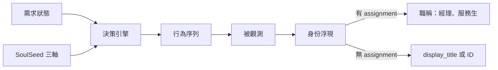

# 身份湧現與社交行為

**身份永遠是結果，不是輸入。** NPC 不需要「知道自己是行腳商還是獵人」，他只需要一組需求驅動的[[npc-system/decision-engine|決策邏輯]]。身份從行為被觀測而來。

---

## 身份湧現

| 行為組合 | 觀察者感受 |
|----------|-----------|
| 鎂低 + 低大膽度 + 高秩序感 → 求職 | 勤奮的打工仔 |
| 鎂低 + 高大膽度 + 低秩序感 → 帶貨兜售 | 投機的行腳商 |
| 鎂低 → 求職 → 沒空缺 → 移動 → 鎂耗盡 → 就地乞討 → 繼續求職 | 窮途末路但沒放棄的人 |
| 所有方案不可行 → 坐在路邊發呆抱怨 | 徹底放棄的流浪漢 |
| 有職 + 採集 + 帶貨賣 | 行腳商 |
| 有職 + 在店 + 站櫃 | 店員 |

職稱來自 assignment 推導（`GetNPCTitle`），顯示名稱在有指派時為職稱（經理、服務生），無指派時為 display_title 或 ID。

---

## 社交行為（NPC 之間）

### 微互動（Ambient）

同房 ≥2 NPC 時，閒置 tick 15% 機率觸發。固定句型如「朝 B 點了點頭」「與 B 閒聊了幾句」等。純敘事推送，不寫入[[npc-system/memory|記憶]]。僅在有玩家的房間觸發。

### AI 對話

優先於微互動。同房兩 NPC 由 Ollama 生成一來一往兩句，帶雙方背版、房間、時段。上下文組裝含：

- 硬規則
- 說話者/聽者背版（≤60 字）
- 現場資訊
- 話題與 phase
- 關係描述
- 過往摘要（≤40 字）

### 主題劇本

`npc_to_npc_topics.json` 定義主題（交班/閒聊/打探），支援 topic mask：

| mask | 說明 |
|------|------|
| `requires_work` | 只在工作 venue 出現 |
| `night_only` | 只在夜間時段出現 |
| `follow_up` | L0 有事件時提高權重 |

### 品質門檻

`qualityGateNpcLine` 寧嚴勿鬆。自動檢查：

- **長度**：過短或過長皆拒
- **禁詞**：後設句（meta-commentary）
- **人稱一致性**：不混淆說話者身份

失敗降級為模板句或沉默，不無限重試洗版。

### 社交行為實作狀態

| 項目 | 狀態 |
|------|:----:|
| 微互動 | ✅ |
| NPC↔NPC AI 對話 | ✅ |
| 主題劇本 | ✅ |
| 品質門檻 + 統計 | ✅ |
| NPC vs NPC 戰鬥 | ⬜ |
| NPC 與 NPC 交易 | ⬜ |

---

## 相關頁面

- [[npc-system/index|NPC 系統總覽]]
- [[npc-system/decision-engine|決策引擎]]
- [[npc-system/dialogue|對話系統]]
- [[npc-system/memory|記憶系統]]
