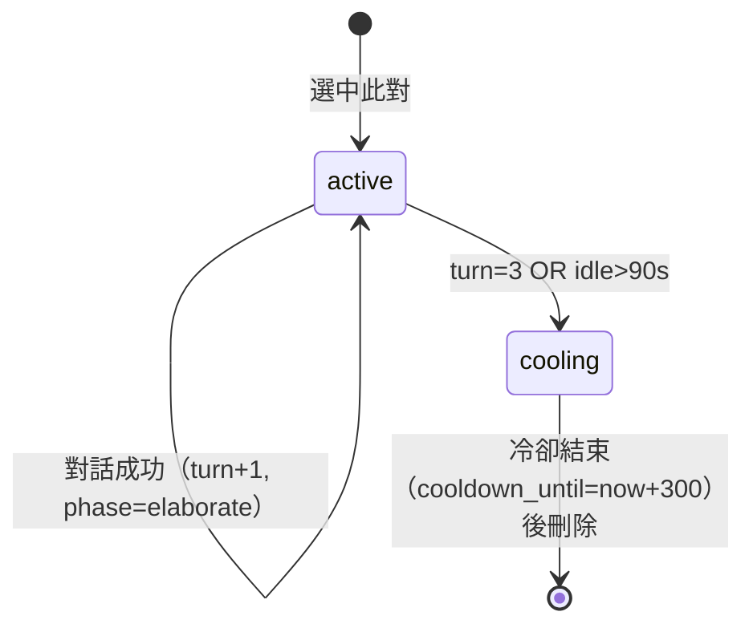

# 記憶系統

NPC 記憶系統採 Letta 式分層架構，類比人類認知心理學的記憶模型。分為玩家↔NPC 記憶與 NPC↔NPC 記憶兩大系統。

---

## 架構概覽

| 人類記憶 | 遊戲對應 | 說明 |
|----------|----------|------|
| 感覺登錄 → 注意篩選 | 每輪對話原始訊息 | 只將「值得記的」寫入 |
| 短期/工作記憶 | 當前 context 視窗 | 最近幾輪對話、背版摘要 |
| 長期儲存 | Archival + Blocks | 語意檢索、持久化 |
| 記憶鞏固 | Consolidation | 對話結束時壓縮為摘要 |
| 提取線索 | 語意搜尋 | 用當前話題/玩家輸入當 query |

```mermaid
flowchart TB
    subgraph 玩家↔NPC
        B[Blocks 背版：我是誰] --> P[Prompt 組裝]
        A[Archival：發生過什麼] --> P
        C[Consolidation：對話結束壓縮] --> A
    end
    subgraph NPC↔NPC 四層
        L0[L0 現場層：房間事件滑窗] --> CTX[上下文組裝]
        L1[L1 話題層：Thread] --> CTX
        L2[L2 關係層：Dyad] --> CTX
        L3[L3 社會事實層：Rumors] --> CTX
    end
```

---

## 玩家↔NPC 記憶

### 背版（Blocks）—— 「我是誰」

| 區塊 | 內容 | 狀態 |
|------|------|:----:|
| **identity** | 職稱、場所、性格、心境、最近事件 | ✅ |
| **summary** | 與玩家的最近印象 | ✅ |
| **relationship** | 與當前玩家有關的記憶 | ✅ |

背版由 `BuildIdentity()` 組裝，Talk 前自動帶入 prompt。

### Archival —— 「發生過什麼」

- **寫入**：對話結束 consolidation（逾時 2 分鐘後，整場壓成 1-3 條寫入）
- **檢索**：`SearchArchivalForPlayerTalk`——多關鍵字評分檢索，零命中時不 fallback 到無關最新條
- **節流**：每場最多 3 條、每 NPC 每 10 分鐘最多 3 條、總量上限 100 條
- **持久化**：PostgreSQL（權威）+ JSON 備份

---

## NPC↔NPC 記憶（四層模型）

### L0：現場層

- **持久化**：In-memory
- **內容**：房間事件滑窗（進出、換班、動靜）
- **規格**：每房最近 5 條、120 秒存活

### L1：話題層（Thread）

- **持久化**：JSON / PostgreSQL
- **內容**：同一對 NPC 的話題線
- **欄位**：topic_type、phase（opening → elaborate → cooling）、anchors
- **規格**：最大 3 輪，冷卻 300 秒

#### Thread 生命週期



### L2：關係層（Dyad）

- **持久化**：JSON / PostgreSQL
- **內容**：兩兩關係記錄
- **欄位**：
  - `familiarity`：0–100
  - `sentiment`：-100 ~ 100
  - `tags`：同職場 / 曾口角 / 欠人情

### L3：社會事實層（Rumors）

- **持久化**：JSON / PostgreSQL
- **內容**：社會傳聞（衰減 + top-K 注入）

#### 傳聞系統規則

- **來源分層**：room_event / economy / spawn / job，各有來源權重
- **去重**：同來源配額 + 同文本冷卻去重
- **升降權**：被引用升權、長期未引用降權
- **衝突懲罰**：衝突傳聞反事實懲罰（降權 + 15 分鐘封鎖）

---

## 四層交互關係

| 層 | 名稱 | 持久化 | 說明 |
|---|------|--------|------|
| **L0** | 現場層 | In-memory | 房間事件滑窗（進出、換班、動靜）；每房最近 5 條、120 秒 |
| **L1** | 話題層（Thread） | JSON/PG | 同一對 NPC 的話題線：topic_type、phase、anchors、最大 3 輪冷卻 300 秒 |
| **L2** | 關係層（Dyad） | JSON/PG | 兩兩關係：familiarity（0-100）、sentiment（-100~100）、tags |
| **L3** | 社會事實層（Rumors） | JSON/PG | 社會傳聞（衰減 + top-K 注入）、來源分層、被引用升權、衝突反事實懲罰 |

L0 提供即時情境，L1 維持對話連貫性，L2 影響[[npc-system/dialogue|配對分數]]（`familiarity / 20`），L3 為閒聊提供話題素材。

---

## 實作狀態

| 項目 | 狀態 |
|------|:----:|
| 背版組裝（BuildIdentity） | ✅ |
| Archival 寫入 + 檢索 | ✅ |
| 對話結束 consolidation | ✅ |
| NPC 間摘要（NpcNpcSummaries） | ✅ |
| Thread 話題線（npc_thread） | ✅ |
| Dyad 兩兩關係（npc_dyad） | ✅ |
| Rumors 傳聞池 | ✅ |
| 語意檢索（embedding + 向量） | ⬜ |
| Blocks 可更新（LLM 整理 archival → summary） | ⬜ |

---

## 相關頁面

- [[npc-system/index|NPC 系統總覽]]
- [[npc-system/decision-engine|決策引擎]]
- [[npc-system/dialogue|對話系統]]
- [[npc-system/identity-emergence|身份湧現與社交行為]]
