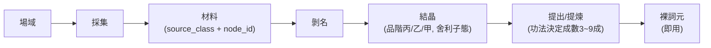

# 資源五層管線

**日期：** 2026-04-08

## 管線結構



```
場域 → 採集 → 材料(source_class + node_id)
               → 剝名 → 結晶(品階丙/乙/甲, 舍利子態)
                         → 提出/提煉(功法決定成數3~9成) → 裸詞元(即用)
```

## 定案清單（11 項）

1. 管線從三層擴展為五層，每層職責不重疊
2. 詞元結晶（舍利子態）：烙印脫離物質後自然凝結，可儲存可交易
3. 結晶僅品階可測，屬性不可知；市場定價以「品階＋產地」為錨
4. 兩層品質拆開：品階（丙/乙/甲，剝名擲骰）× 提取成數（3~9成，功法決定）
5. 剝名＝人類基礎能力，無需工具/場所/技能
6. 「官方剝名處」正名為官方提出處
7. 單剝/合剝模式：合剝＝多材料烙印向量疊加，結果不可預測
8. 材料分類：五大來源類（礦/獸/植/水/氣）＋產地節點 ID
9. 結晶堆疊＝純 UI 壓縮，不影響操作語義
10. 背包新增 material 和 crystal 類型，裸詞元不進背包
11. 世界觀文件 Token降維 §二和§九已對齊五層管線

## 修改的文件

- docs/design/資源點與礦區設計.md
- docs/reference/世界觀：Token降維與生命演化.md
- docs/reference/詞盤系統收斂規格.md
- docs/reference/背包規格.md
- docs/design/資源點設置與產出—實作建議.md

## 開放項

- Token 密度公式 f(人數)
- 功法成數數值公式（等功法系統骨架）
- 合剝向量疊加模擬測試（等詞盤引擎原型）
- 資源節點 stripping_weights 生成規格
- 礦區房間佈局（等地圖落地）

---

## 相關頁面

- [[concepts/worldview|世界觀]] — Token 輻射與富態化
- [[concepts/rust-migration|Rust 遷移決策]]
- [[concepts/wenyanwen-compression|文言文壓縮框架]]
- [[concepts/wordplate-system/index|詞盤系統]]
- [[concepts/economy/index|經濟系統]]
