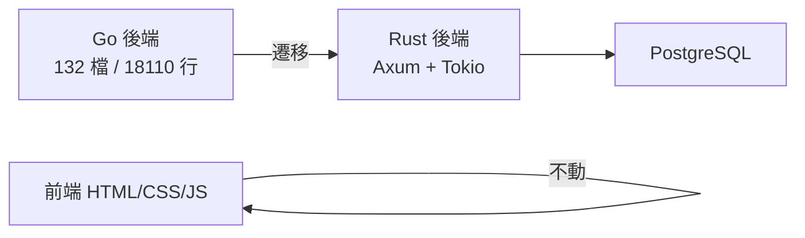

# Rust 遷移決策

**日期：** 2026-03-24

## 決策

將 singularity_world 後端從 Go 遷移至 Rust。

## 原因

- Go 型別系統無法強制 AI 代理遵守紀律（159 處 `_ =` 忽略錯誤）
- 程式語言對設計者有雙重用途：(1) 蓋建築 (2) 控制 AI 建築師不偷工
- Rust 的 `cargo check` 是起飛前檢查，Go 的 `go vet` 覆蓋不足
- 被忽略的錯誤造成「鬼故事」：NPC 行為異常、資料靜默遺失

## 上次失敗教訓（2025-12 ~ 2026-01）

- Bevy ECS + Dioxus WASM 全棧，技術選型過重
- Dioxus 0.7 不成熟、WASM 除錯地獄
- 問題不是 Rust 本身，是架構選型

## 技術棧約束

| 層 | 選型 |
|----|------|
| HTTP/WebSocket | axum + tokio-tungstenite |
| JSON | serde + serde_json |
| async | tokio |
| 前端 | 不動，原生 HTML/CSS/JS |
| **禁止** | Bevy、ECS、WASM、前端框架 |

## 遷移策略

- 先出設計文件再動手（地基優先）
- Go 版 132 檔 / 18110 行
- 前端一行不動，只重寫後端

---

## 相關頁面

- [[concepts/resource-pipeline|資源管線]]
- [[concepts/hex-visual|Hex 視覺調整]]
- [[concepts/design-decisions|設計決策與原則]] — ADR-010
