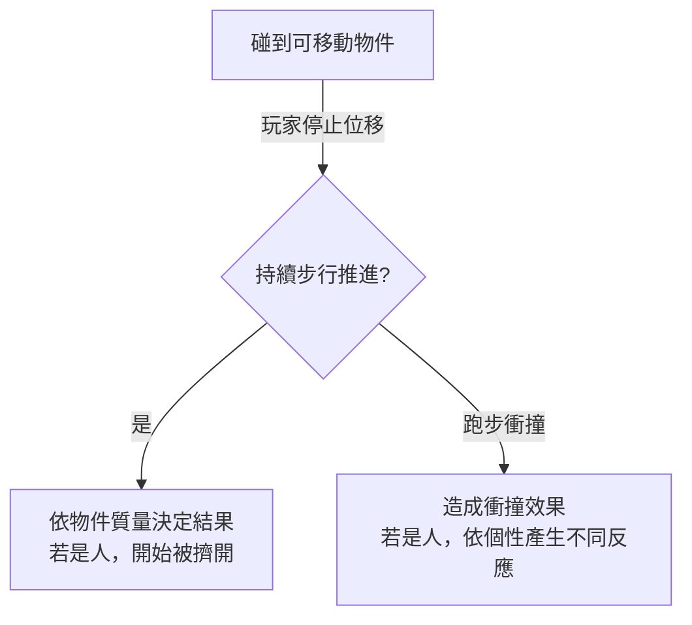

# 格內連續移動

**日期：** 2026-04-10

## 移動模式（設計者定案）

- **連續像素級移動**，嚴禁跳棋式（整格跳轉）
- **步行／跑步**兩種模式
- 移動速度受地形 move_cost 影響（沼澤慢、道路快）

## 碰撞階梯

1. **碰到可移動物件** → 玩家停止位移
2. **持續步行推進** → 依物件質量決定結果；若是人，開始被擠開
3. **跑步衝撞** → 造成衝撞效果；若是人，依其個性產生不同反應

## 六角格本質

- 六角格**只是地理性質的邊界劃分**（地形類型、move_cost）
- 跨格邊界對移動**無感**，不構成阻礙
- 唯一阻力來源是地形屬性和格內實體（碰撞）

## 待辦

現行 move_by_hex_direction 整格移動需重構為像素級連續移動。

---

## 相關頁面

- [[concepts/hex-visual|Hex 視覺調整]]
- [[concepts/hex-map/index|Hex 地圖]]
- [[concepts/design-decisions|設計決策與原則]]
