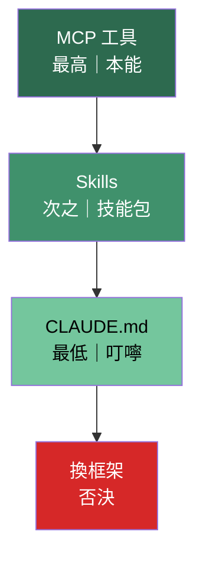

# 工具策略：裝備優先原則

> 2026-04-11 確立並落地。從框架評估討論中收斂的核心共識。

---

## 背景

評估了所有 Claude Code 洩露後的 Rust 開源重寫版本（Claw Code 181k星、IronClaw 11.6k星、Claurst 8.9k星、claw-code-local 等），得出結論：**不換框架，擴裝備**。

## 核心共識

### 擴能力的優先級



| 優先級 | 層級 | 機制 | 原因 |
|--------|------|------|------|
| 最高 | **MCP 工具** | 本能 | Code Claude 每輪先盤工具，工具是核心指令 |
| 次之 | **Skills** | 技能包 | 官方認可的能力擴展 |
| 最低 | **CLAUDE.md** | 叮嚀 | 外加規矩，權重低於工具 |
| 否決 | 換框架 | — | 穩定性不足，不考慮 |

### 為什麼不換框架

- Anthropic 官方的編碼提示詞是審碼品質的唯一錨點
- 設計者不懂代碼、不碰代碼，無法驗證審碼是否正確，完全依賴官方提示詞的紀律
- 所有開源替代品都不到兩週大，穩定性遠不如官方
- 選框架跟選 OS 一樣：用 Mint 不用 Arch，求穩

### 為什麼工具 > 指令

- 工具是本能——Claude 每輪思考都會先盤點手上有什麼工具，這是核心指令層級
- CLAUDE.md 是叮嚀——寫再多規矩，權重都比不上一個 MCP 工具
- 工具改變思維模式，指令只是提醒

### MCP＝插頭插座

MCP 的概念與專案的 [[concepts/design-decisions|ADR-002（插頭／插座語義）]] 完全一致：

- MCP server 告訴 Claude「我叫什麼名、吃什麼參數、回什麼結果」
- Claude 自動將其視為可用工具
- 任何能力只要包成 MCP server，就融入 Claude 的工具思維

---

## 已落地裝備（2026-04-11）

### MCP 工具（~/.claude/.mcp.json）

| MCP | 類型 | 用途 |
|-----|------|------|
| **GraphThulhu** | Obsidian 圖譜 | 反向連結、路徑尋找、主題群、知識缺口偵測 |
| **llm-wiki-kit** | Wiki 編譯器 | Karpathy 模式的 ingest/compile/query/lint |
| **Brave Search** | 搜尋引擎 | 比內建 WebSearch 更好的搜尋 |
| **GitHub** | 代碼協作 | PR、issue、diff 直接看 |
| **PostgreSQL** | 資料庫 | 唯讀查遊戲 DB（singularity） |

### 既有 MCP（claude.ai 託管）

Canva、Gmail、Google Calendar、Context7

### Skills

- **llm-wiki**（`~/.claude/skills/llm-wiki/`）— Karpathy Wiki 的 ingest/compile/lint SOP

### 知識庫雙軌

| 層 | 工具 | 用途 |
|----|------|------|
| **展示層** | Wiki.js（wiki.ygggt.com） | 給人看，22+ 頁 |
| **工作層** | Obsidian vault（~/Projects/obsidian-vault/） | 給 Claude 讀寫＋圖譜查詢 |

---

## Advisor Tool（待整合）

Anthropic 2026-04-09 推出 Advisor Tool（API Beta）：

- Executor（Sonnet）寫碼→關鍵節點自動呼叫 Advisor（Opus）審查
- 成本降 85%，品質提升
- Code Claude 尚未內建，settings.json 已有 `advisorModel` 欄位
- 一旦可用，設計者不再需要在碼農和 Opus 之間手動傳話

---

## 行動原則

1. **官方/認可優先** — 自建 MCP 是最後手段
2. **出規格讓碼農做** — 設計者決定需要什麼能力，碼農包成 MCP server
3. **CLAUDE.md 精簡化** — 只留角色定位，不堆行為規矩
4. **備案保留不主動使用** — claurst/spec/（逆向規格）、claw-code-local（本地模型代理）

---

## OAuth 備查

從 claurst/spec/ 逆向取得的 Code Claude OAuth 完整參數：

- CLIENT_ID: `9d1c250a-e61b-44d9-88ed-5944d1962f5e`
- 授權 URL: `https://claude.com/cai/oauth/authorize`
- Token URL: `https://platform.claude.com/v1/oauth/token`
- API Base: `https://api.anthropic.com`
- Scopes: `user:profile`, `user:inference`, `user:sessions:claude_code`, `user:mcp_servers`, `user:file_upload`
- Token 存放: `~/.claude/.credentials.json`

---

## Rust 開源版本總覽（備查）

| 專案 | 星數 | 定位 | 判斷 |
|------|------|------|------|
| Claw Code (ultraworkers) | 181k | 代理優先 | 最大社群，但偏自動化 |
| IronClaw (NEAR AI) | 11.6k | 安全+多通道 | 過度工程 |
| Claurst (Kuberwastaken) | 8.9k | 個人開發者 | 花俏但太早期 |
| claw-code-local | fork | 本地模型 | 已有，上游已封存 |

所有版本本質結構相同：輸入→LLM呼叫→工具執行→回饋→下一輪。差異只在外殼。

---

## 對話歷史管理（2026-04-11 追加）

### claude-historian-mcp

已安裝。搜尋 Claude Code 對話歷史的 MCP server（TypeScript，207 星，活躍維護）。

| 工具 | 用途 |
|------|------|
| `search` | TF-IDF＋模糊匹配搜尋歷史對話，支援 scope/時間範圍/專案過濾 |
| `inspect` | 對單一 session 做智慧摘要 |

設定：`~/.claude/.mcp.json` 裡的 `claude-historian`，用 Node 22 的 npx 跑。

### claude-extract 自動化

`claude-conversation-extractor` 已設 cron 每小時自動匯出：

```
0 * * * * ~/.local/bin/claude-extract --all
```

匯出到 `~/Desktop/Claude logs/`，乾淨 md 檔，無 JSONL 雜訊。

### 兩者分工

| 工具 | 給誰用 | 解決什麼 |
|------|--------|---------|
| historian-mcp | Claude（MCP 工具） | 對話中即時搜 JSONL |
| claude-extract | 人＋Claude（md 檔） | 過濾雜訊產出可讀 md |

### 評估過但不採用的

| 專案 | 原因 |
|------|------|
| claude-conversation-search-mcp (Rust/Tantivy) | BM25 對中文分詞差，5 星 |
| cc-conversation-search (Python/FTS5) | 不是 MCP，4 個月沒更新 |
| claude-code-history-mcp | 9 個月沒維護，功能比 historian 少 |
| claude-code-vector-memory | 不是 MCP，手動 reindex，停滯 |

---

## 相關頁面

- [[concepts/design-decisions|設計決策與原則]] — ADR 一覽
- [[concepts/rust-migration|Rust 遷移決策]]
