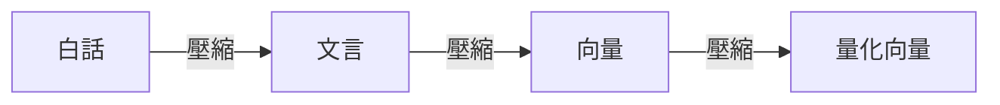

# 文言文壓縮框架

**日期：** 2026-04-07

## 核心發現

- 文言文天然是壓縮語言：「事故：基崩，雨季，工偷」兩字錨點＋六字骨架＝完整語意
- 錨點是解壓演算法的選擇器——觸發模型內建的分析框架（人機物法環、人事時地物等）
- 框架觸發跟參數量無關（0.8B 都能觸發），還原品質跟參數正相關
- 思考模式決定地板

## 壓縮管線

每層壓縮率相乘。

## 與詞盤的關係

用戶的 [[concepts/wordplate-system/index|詞盤]] 三五七字成句是同一套原理，解壓端是玩家腦子。

## 應用場景

- AI 記憶壓縮
- 遊戲對話系統
- 任何需要高壓縮率語意存儲的場景

---

## 相關頁面

- [[concepts/resource-pipeline|資源管線]]
- [[concepts/wordplate-system/index|詞盤系統]]
