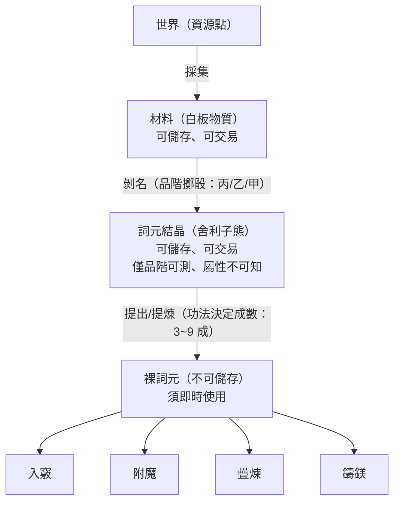
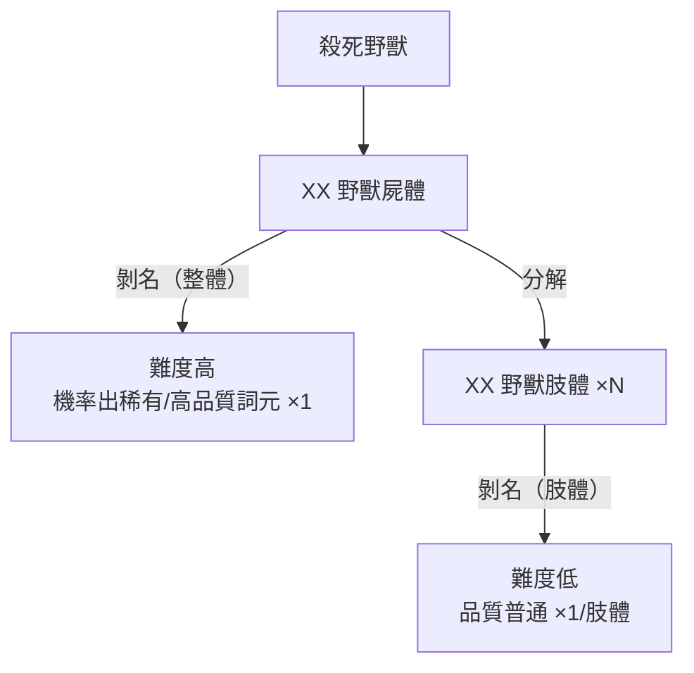

# 五層管線

> 詞元從世界中誕生到可用狀態，經過五個階段：採集 → 材料 → 剝名 → 結晶 → 提出。每一層都是取捨點。

## 管線流程



## 各層詳解

### 第一層：採集

從世界資源點取得原始材料。資源點的類別對應[[word-vectors|五類來源]]（獸、植、礦、水、氣）。

> **缺設計（P0）**：資源點的位置、採集類別/量、環境危險度尚未定案。這是整個進水口的斷點。

### 第二層：材料

白板物質，無屬性。可儲存於[[skills-and-equipment|背包]]、可在市場交易。

**背包堆疊規則**：材料在背包中以 `item_type = "material"` 存在，堆疊條件為**同來源類（`source_class`）+ 同產地節點（`source_node_id`）**。範例：蒼嶺礦石 ×5、深谷草藥 ×3。

### 第三層：剝名

對材料執行剝名，擲骰決定品階。

**品階**：丙（普通）/ 乙（優良）/ 甲（極品）

**品質是擲骰結果，非詞元固有屬性**。「斬」本身沒有品階之分，丙級的「斬」和甲級的「斬」差別在於剝名那一刻的運氣。

**已定案（2026-04-08）**

### 第四層：詞元結晶

舍利子態。可儲存、可交易。關鍵限制：**僅品階可測，屬性不可知**——買方只知道這是甲級結晶，不知道裡面是「斬」還是「盾」。

**背包堆疊規則**：結晶在背包中以 `item_type = "crystal"` 存在，堆疊條件為**同來源類（`source_class`）+ 同產地節點（`source_node_id`）+ 同品階**。堆疊為**純 UI 壓縮**（2026-04-08 定案），不影響操作語義——提出/剝名時仍逐顆處理。

**已定案（2026-04-08）**：結晶流通規則確認。

### 第五層：提出/提煉

功法決定提取成數（3~9 成）。提出後成為裸詞元。

**裸詞元不可儲存**，不進背包，須即時使用——進入[[three-fork|三叉路口]]（入竅/附魔/疊煉/鑄鎂）四選一。

## 兩層品質系統

最終詞元效力由兩個獨立變數相乘：

```
最終效力 = 品階（丙/乙/甲，剝名時擲骰） × 提取成數（功法決定，3~9 成）
```

- 甲級結晶 + 9 成功法 = 頂級詞元
- 甲級結晶 + 3 成功法 = 浪費好結晶
- 丙級結晶 + 9 成功法 = 頂級丙，但仍是丙

## 剝名流程細節

**已定案（2026-04-08）**



**整體剝名** = 高風險高報酬
**分解剝名** = 低風險穩定產出

- 屍體態：提供「剝名」和「分解」兩個插座
- 肢體態：僅提供「剝名」插座（不可再分解）

NPC 非觀測狀態下的處置為純公式（性格參數 + 背包狀態決定路線）。

## 插座/插頭對接

管線中的每個操作遵循全專案統一的[[three-fork|插頭/插座]]語義：

| 目標 | 插座 | 說明 |
|------|------|------|
| 野獸屍體 | 剝名、分解 | 分解後變肢體 |
| 野獸肢體 | 剝名 | 不可再分解 |
| 詞元結晶 | 提出 | 功法決定成數 |
| 材料 | 剝名 | 材料→結晶 |

## 背包中的管線物品

管線各階段的物品在[[skills-and-equipment|背包]]中的對應：

| 管線階段 | 背包 item_type | 可堆疊 | 堆疊條件 |
|----------|---------------|--------|----------|
| 材料（白板物質） | `material` | 是 | 同 `source_class` + 同 `source_node_id` |
| 詞元結晶（舍利子態） | `crystal` | 是 | 同 `source_class` + 同 `source_node_id` + 同品階 |
| 裸詞元 | **不進背包** | — | 須即時使用 |

## 相關頁面

- [[index]] — 詞盤系統總覽
- [[word-vectors]] — 詞元的資料結構與向量
- [[three-fork]] — 裸詞元到手後的四條路
- [[skills-and-equipment]] — 背包中材料與結晶的堆疊規則

---

*編譯自設計文檔群，2026-04-11*
