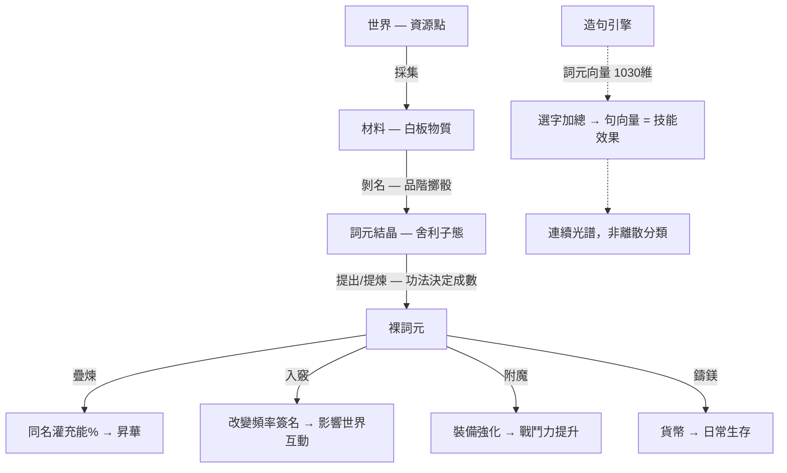

# 詞盤系統

> 奇點世界的核心養成引擎。詞盤不是 LLM，是純數學系統——500 顆詞元的 1030 維向量在向量空間中合成技能效果，萬名 NPC 同時運算不吃算力。

## 核心概念

### 詞盤是數學引擎，不是 LLM

**已定案（2026-03-28）**

詞盤的造句、祭煉、技能編譯，本質是**字庫排列組合 + 品質門檻過濾**，與 LLM 完全無關。

| 遊戲概念 | 對應的數學本質 |
|----------|--------------|
| 字庫／詞庫 | Token vocabulary（500 顆詞元） |
| 排列組合 | Combinatorial sampling |
| 好句入池壞句回爐 | Quality gate |
| 玩家的詞盤配置 | 調整推論參數（類比） |
| 骰出句子 | Inference |
| 句子效能數值 | Output quality |

NPC 的 `soul_seed` 決定其詞盤佈局 → 佈局決定可組出的組合 → 組合決定產出品質。全程純公式。

### 世界觀定位

- **Token**：無處不在卻無法直接接觸的存在，萬事萬物皆受它影響。人類因它而能將所見表達出來——紀錄→文字→詞元。詞元可強化內（內盤、竅穴、人身）與外（裝備、外在詞盤）。
- **詞盤**：「名的登錄處」。萬物皆有名，名由詞元構成，詞盤承載與排列詞元。
- **三層詞盤**：
  - **個人詞盤（內盤）**：在人身，以竅穴為載體。竅穴打通 → 普通加成；詞元入竅 → 特殊加成；連線 → 額外加成。
  - **機構詞盤**：各國金融機構的鎂字流轉總帳——誰持多少鎂、誰對誰賦權、哪些契約被承認。
  - **世界詞盤**：記載一切可名之物的總目錄；透過探索、傳承、交易，文明把新的「名」寫進世界詞盤邊緣。
- **核心循環**：收集字 → 造句 → 祭煉成敘事 → 系統判定 → 生成技能效果或屬性加成。

### 名與物質的閉環

未被詞元觸及的物質尚無「名」，無法被紀錄、交易。冒險者蒐集詞元或剝名，即擴充可被表達的邊界；鎂字為「名之名的單位」。

### 鎂與詞元：同名異源

**已定案（2026-03-28）**

| | 鎂（貨幣） | 野生詞元（功能物件） |
|--|-----------|-------------------|
| **來源** | 鎂池——機構制度性創造，與人口掛鉤（創角 +10,000 錠） | 採集 → 剝名 → 結晶 → 提出（[[five-layer-pipeline|五層管線]]） |
| **屬性** | 無屬性，純交換媒介 | 帶屬性（火、堅韌、疾速等） |
| **用途** | 買賣、附魔/強化消耗、登錄費、打通消耗 | 入竅、附魔、祭煉造句 |
| **性質** | 標準化、可分割、機構記帳 | 功能性、品質分級、不可替代 |

共享「詞元」作為計量單位名稱，但**來源不同、性質不同**。花鎂買麵包不會削弱你，因為你花的是制度貨幣，不是竅穴裡的東西。

> **衝突**：詞盤彙整 §一「token 又名詞元，定位世界通用幣最小單位」的措辭與此矛盾——**以 2026-03-28 對談為準**，鎂與野生詞元是不同東西。

### 賦權的兩面

一為「賦予名分」——使某物、某約、某筆帳被承認、可紀錄；一為「賦予權能」——持鎂者能交換、訂約、執行技能、驅動附魔。鎂字經機構賦權後流通；各國共用同一套鎂。

### 剝名

因 Token 賦權，人類能將物或獸上的「名」剝下。**代價**：該物或獸消散。**所得**：剝下的名帶有屬性（火、堅韌、疾速、靈敏等），成為帶屬性的詞元，供附魔、強化、成長。**邊界**：人對人剝名 Token 無反應；人對獸、對物可行（陽光奇點）。

### 詞元分類與層級

| 層級 | 說明 |
|------|------|
| **鎂字** | 世界通用貨幣與賦權基準；經機構賦權後流通；不從剝名取得 |
| **剝名所得詞元** | 從物或獸剝下的名，帶來源屬性；依稀有度可視為地域級或更高 |
| **通用詞元** | 人人可感應、可納入內盤；對應常見物產名、基礎技藝名 |
| **地域／傳承詞元** | 特定地域、族群、師門才有；觸發較強特殊加成或連線 |
| **禁忌／失傳詞元** | 曾從世界詞盤抹除或封存；陽光向可設為稀少但不走殘酷代價 |
| **個體專屬詞元** | 極少數個體與某「名」共振產出、僅此人可用；與自創技能掛鉤 |

## 管路模型：進水口 → 引擎 → 出水口

### 進水口

詞元的來源是一條[[five-layer-pipeline|五層管線]]（採集→材料→剝名→結晶→提出）。**目前斷點**：資源點（在哪採、採什麼、多少量）尚未落地。

### 引擎

| 環節 | 說明 | 狀態 |
|------|------|------|
| 入竅 | 詞元放入已打通的竅穴，產生特殊加成 | ✅ 規格定案 |
| 連線 | 多竅穴依拓撲規則連通，觸發額外加成 | ✅ 規格定案 |
| [[sentence-crafting|造句]] | 向量引擎 | ✅ 定案 |
| 祭煉 | 造句登錄於詞盤，系統判定後生成 SkillObject | ✅ 概念定案 |
| 品質 | 品質 = 剝名時擲骰結果，非詞元固有屬性 | ✅ 定案 |
| [[three-fork|疊煉]] | 同名詞元疊加灌充能%，滿 100% 擲骰昇華 | ✅ 定案 |

### 出水口

| 影響面 | 說明 | 狀態 |
|--------|------|------|
| [[skills-and-equipment|戰鬥]] | α/β/γ 係數、有效體敏氣 | ✅ 已接線 |
| 採集效率 | 詞盤頻率 → 與資源的共振 → 品質偏好 | ❌ 缺設計 |
| 環境耐受 | 頻率 → 聚念場貢獻 → 荒野生存能力 | ❌ 缺設計 |
| 社交相容 | 頻率相近 → 同頻相斥效應 | ❌ 缺設計 |
| [[skills-and-equipment|技能]] | SkillObject 讀取 | ✅ 概念定案 |

**現狀**：出水口只接了戰鬥一條。頻率→世界互動的設計只停在概念層。

## 閉環總覽



## 子頁面

| 頁面 | 內容 |
|------|------|
| [[word-vectors]] | 500 詞元 × 1030 維向量、十類語義、五類來源、embedding 生成與儲存 |
| [[five-layer-pipeline]] | 五層管線（採集 → 材料 → 剝名 → 結晶 → 提出）、兩層品質系統 |
| [[sentence-crafting]] | 造句系統、向量引擎、三五七字句式、三階共振、SkillObject 編譯 |
| [[three-fork]] | 三叉路口（入竅/附魔/鑄鎂）、插座/插頭交互、疊煉系統、頻率簽名 |
| [[skills-and-equipment]] | 技能分頁（全機率 Tick 戰鬥、觸發權重公式、功法系統）、裝備 20 槽位、背包負重 |

## 決策狀態

### 已定案

| 項目 | 定案時間 |
|------|---------|
| 詞盤是數學引擎，非 LLM | 2026-03-28 |
| 鎂與詞元異源（制度貨幣 vs 功能物件） | 2026-03-28 |
| 造句 = 向量引擎（1030 維混合向量） | 2026-03-28 |
| 詞元池 500 顆 × 十類語義 | 已完成（word_elements.json） |
| Embedding 生成（bge-m3 1024 維 + 6 維 gamedims） | 已完成（pgvector） |
| 品質 = 剝名擲骰結果，非詞元固有屬性 | 2026-03-28 |
| 疊煉系統（同名灌充能 → 昇華） | 2026-03-28 |
| 三叉路口（入竅/附魔/鑄鎂） | 2026-03-28 |
| 剝名流程（屍體整剝 vs 肢解分剝） | 2026-04-08 |
| 結晶流通（可儲存交易，僅品階可測） | 2026-04-08 |
| 插頭/插座交互語義 | 已決斷 |
| 裝備 20 槽位 MUD 式 | 已定案 |
| 背包負重制（無格子、flat list） | 已定案 |
| 全機率 Tick 戰鬥（無主動施放） | 已定案 |
| 功法無掛載上限（動態權重淘汰） | 已定案 |
| 心法同時僅運轉一套 | 已定案 |

### 已知衝突

| # | 衝突點 | 處理 |
|---|--------|------|
| 1 | 詞盤彙整 §一「token 又名詞元，定位世界通用幣最小單位」vs 2026-03-28 定案鎂與詞元異源 | **以對談為準**，更新彙整措辭 |
| 2 | 詞盤彙整 §9.4「系統判定中文邏輯、語順、語意」vs 2026-03-28 定案造句=組合數學+品質門檻 | **以對談為準**——造句是向量合成，不是 NLP |
| 3 | 經濟彙整未定創角配給 vs 2026-03-28 對談確認 10,000 錠 | **以對談為準** |

### 缺設計（需設計者拍板）

| # | 缺口 | 優先級 |
|---|------|--------|
| 1 | **資源點**：在哪採、採什麼類別/量、環境危險度 | **P0** |
| 2 | 疊煉公式具體落地 | P1 |
| 3 | 功法藍圖：路徑定義（哪些節點依序打通） | P1 |
| 4 | **鑄鎂機制**：地點、條件、兌換比例 | P2 |
| 5 | **頻率量化**：詞盤配置 → 頻率數值的計算公式 | P2 |
| 6 | **頻率→世界效果**：影響採集/環境/社交的數值表 | P2 |
| 7 | 採集效率、環境耐受、社交相容（出水口擴展） | P2 |

**修復順序**：探索式生成落地 → 資源點配置（P0）→ 疊煉公式（P1）→ 頻率量化（P2）→ 頻率→世界效果（P2）。

## 後端對接要點

### 有效屬性疊加公式

```
有效屬性 = 基礎（SoulSeed 展開之三軸/常數）
         + 竅穴普通加成
         + 詞元特殊加成
         + 連線加成
         + 裝備加成
```

後端依此順序彙總後代入戰鬥公式。

### 與 361 拓撲對接

若採用 361 竅穴系統，竅穴 = 361 中已打通之節點。打通某節點即依該節點系屬（體/氣/敏）產出對應普通加成。第一版可採簡化對應（僅計打通數量或主樞）。

## 相關頁面

- [[worldview]] — Token 降維與生命演化、聚念場、同頻相斥
- [[character-system]] — 三軸念紋、竅穴加成疊加公式、361 拓撲
- [[economy]] — 鎂的產消閉環、機構賦權、交易

---

*編譯自設計文檔群，2026-04-11*
