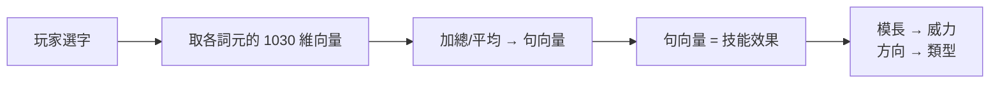
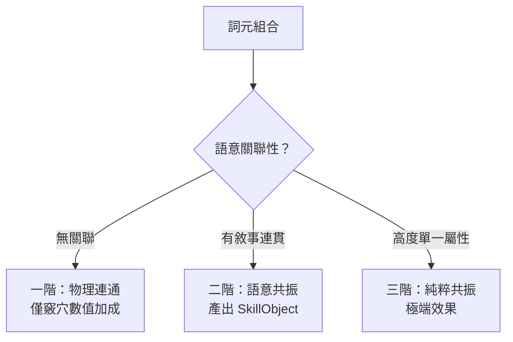

# 造句系統（向量引擎）

> 造句驗證與效果計算基於 pgvector 語義向量，不查表、不用 LLM。玩家選字組句，句向量本身即技能效果。

**已定案（2026-03-28，同日修訂為向量制）**

## 核心機制

1. 玩家選字組句
2. 將所選詞元的[[word-vectors|1030 維向量]]**加總/平均** → 得到**句向量**
3. 句向量本身即技能效果——向量的每個分量是隱式維度（攻擊性、防禦性、速度感、持續性等，由 embedding 自然學得）
4. 句向量的模長/方向決定技能威力與類型，無需手動定義「攻」「防」等維度

### 連續光譜，非離散分類

- 兩個句向量距離近 → 類似的技能
- 換一顆詞元 → 句向量偏移 → 效果**連續滑動**，不是離散跳變
- 「銳·斬·弧」和「堅·盾·殼」在向量空間裡自然落在攻擊區和防禦區的對角

新增詞元 = 寫 desc + 跑 embedding + 填 gamedims，零公式調整。整個技能空間自動擴展。

## 句式長度與精準度

| 字數 | 對應 | 效果 |
|------|------|------|
| 三字 | 三字經 | 籠統加成（如「吾飛也」→ 簡易速度加成） |
| 五字 | 五言句 | 聚焦特定面向（如「吾奔飛速也」→ 敏捷/移動/閃避） |
| 七字 | 七言詩 | 高度精準複合效果（如「吾奔如雷飛速也」→ 多重加成） |

**讀得通 = 給過**。文言文單字即意，國文有上課就不難組句。玩家以為自己發現了新句子，實際上句向量早已在向量空間裡有其位置。

字數越多，句向量越精確地指向特定效果區域；字數越少，向量越模糊、加成越泛。

## 技能命名

技能名由**系統從句中按語義類萃取核心字**組合（2～4 字），不開放玩家自訂。

- 描述 = 完整敘事 + 發明者 + 效果
- 公式命名規則見 `data/config/sentence_engine.json`

命名依據[[word-vectors|十類語義]]的句法位置自動萃取。同一造句僅對應一組技能名與效果；重複提交不重複授名（已登錄則回傳已有技能名）。

## 三階共振

| 共振階層 | 條件 | 結果 |
|----------|------|------|
| 一階（物理連通） | 詞元語意無關聯 | 僅竅穴數值加成，**不產出招式、不進招式池** |
| 二階（語意共振） | 詞元具敘事連貫性（如「飛天梯雲縱」） | 系統判名，產出 SkillObject 進入[[skills-and-equipment|招式池]] |
| 三階（純粹共振） | 詞元屬性高度單一（如「火火炎燄轟」） | 極端效果招式，觸發率極低 |

### 共振與造句的關係

- **一階**：字湊在一起但不成句——沒有敘事性，只有物理上把竅穴連起來的數值加成
- **二階**：字組成讀得通的句子——語意共振觸發，系統判名並產出技能（SkillObject）
- **三階**：極端同質的組合——如全火系詞元，向量高度對齊，產出極端但稀有的效果

**關鍵**：只有二階以上共振產出的技能才會進入實戰招式池（Combat Pool）。

## SkillObject 預編譯

語意判定僅在**煉化入竅（Commit）**或**功法習得**時執行一次，結果編譯為 SkillObject 存入招式池；**戰鬥時不重算語意，只讀 SkillObject**。

### SkillObject 結構

| 欄位 | 類型 | 說明 |
|------|------|------|
| `id` | TEXT | 招式唯一 ID |
| `name` | TEXT | 招式名稱（功法自帶為固定名、系統判名為自動萃取 2～4 字） |
| `source_type` | TEXT | `manual`（功法自帶）/ `inner_resonance`（內盤造句）/ `outer_resonance`（裝備造句） |
| `source_id` | TEXT | 來源功法 ID 或造句 ID |
| `resonance_tier` | INT | 共振階層：2（語意共振）或 3（純粹共振）；功法自帶填 0 |
| `sub_type` | TEXT | 招式所屬子類（劍法、拳術、步法、指法……），用於持物適配度計算 |
| `required_weapon_type` | TEXT/NULL | 需要的持物類型（如 `"鋒刃"`）；null 表示徒手可用 |
| `base_trigger_rate` | FLOAT | 基礎觸發率（0.0～1.0） |
| `cost` | JSON | 資源消耗（如 `{"氣力": 50}` 或 `{"體力": 20}`） |
| `base_effect` | JSON | 基礎效果結構（傷害值、效果類型、影響維度等） |
| `residue_tokens` | JSON | 觸發後殘留於環境的詞元清單（如 `["火","鋒"]`） |
| `description` | TEXT | 招式敘事描述 |

### 招式來源與共振對照

| 來源 | 共振階層 | 進池條件 | 說明 |
|------|----------|----------|------|
| **功法自帶** | — | 習得即進池 | 來自習得之功法，附帶招式直接進入招式池 |
| **內盤造句** | 一階（物理連通） | **不進池** | 僅竅穴基礎數值加成 |
| **內盤造句** | 二階（語意共振） | 進池 | 系統判名產出動態機制/招式 |
| **內盤造句** | 三階（純粹共振） | 進池 | 極端效果，觸發率極低 |
| **裝備造句** | 二階以上 | 進池 | 外盤（裝備）詞元造句共振 |

## 語境殘留（Context Residue）

招式觸發後，核心詞元殘留於戰場（持續數 Tick）。後續 Tick 出現相容詞元 → 語意連鎖反應。

**範例**：[火]+[風] = 爆燃。低傷招式可作為「引信」鋪設環境伏筆。

語境殘留使戰鬥不是單招比大小，而是詞元在時間軸上的語意接龍。

### 相位與連鎖散佈模式

連鎖反應觸發時，角色的**相位（Phase）**決定傷害如何散佈：

| 相位傾向 | 散佈模式 | 說明 |
|----------|----------|------|
| 秩序（Phase 趨近 +1.0） | 精準單體 | 傷害鎖定主目標，數值穩定 |
| 中性（Phase 趨近 0） | 一般散佈 | 依預設規則散佈 |
| 混沌（Phase 趨近 -1.0） | 房間 AOE | 傷害在敵方陣營內隨機彈射，數值大起大落。**絕不波及自身與友方** |

> 具體係數與散佈公式為框架預留，待戰鬥引擎實作時補齊。

## 登錄與流通

自創技能可僅止於內盤（獨門），或申請登錄到工會、門派或世界詞盤邊緣。多敘事可組**陣列**，對應高階效果。

## 相關頁面

- [[index]] — 詞盤系統總覽
- [[word-vectors]] — 詞元向量的技術細節
- [[three-fork]] — 詞元如何入竅影響造句
- [[skills-and-equipment]] — 技能觸發、功法系統與戰鬥系統

---

*編譯自設計文檔群，2026-04-11*
