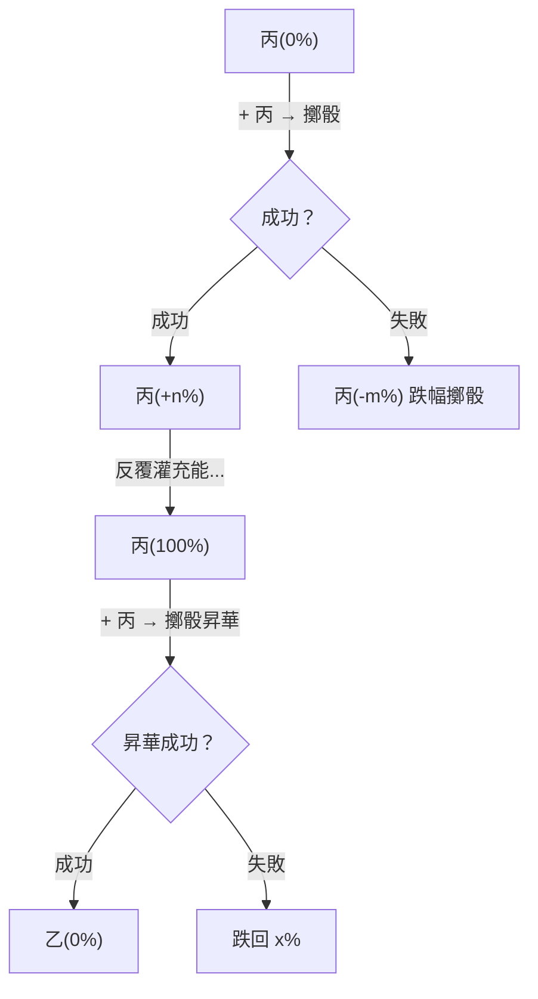

# 三叉路口：入竅 / 附魔 / 鑄鎂

> 每顆裸詞元到手時，三條路（加上疊煉共四條）。品質加深取捨——低品質鑄鎂不心疼，高品質入竅還是附魔？還是賣天價？

**已定案（2026-03-28）**

## 四條去路

| 選擇 | 效果 | 性質 |
|------|------|------|
| **入竅** | 改變自身頻率簽名，永久影響與世界的關係 | 永久、不可逆（或高代價逆轉） |
| **附魔** | 強化裝備，提升眼前戰力 | 半永久，隨裝備更替消失 |
| **鑄鎂** | 換成貨幣，今天能活 | 即時消耗，詞元屬性永久喪失 |
| **疊煉** | 同名灌充能，賭品階昇華 | 消耗性投資 |

> **缺設計**：鑄鎂的具體機制（在哪裡鑄、條件、兌換比例）未定。

## 竅穴系統（入竅）

| 概念 | 說明 |
|------|------|
| 竅穴打通 | 消耗鎂或達條件，產生**普通加成**（體質/氣脈/靈敏） |
| 詞元入竅 | 將詞元納入已打通竅穴，產生**特殊加成**（依詞元屬性） |
| 連線 | 多竅穴依拓撲規則連通，觸發**額外加成**（如火系 3 竅連線 → 火傷+5%） |

### 竅穴類型與加成

| 竅穴類型（可擴充） | 打通後普通加成 | 數值說明 |
|-------------------|--------------|---------|
| 體竅 | 體質 | 承傷減免、負重、耐性；數值＋N 或百分比 |
| 氣竅 | 氣脈 | 續戰、技能/行動消耗、回復；數值＋N 或百分比 |
| 敏竅 | 靈敏 | 命中、閃避、行動序；數值＋N 或百分比 |

竅穴總數/上限由後端常數或角色模板定義（例：每人可打通節點數上限 8～12 或更多）。打通條件：消耗鎂、任務或達到某條件。

### 與 361 拓撲對接

若採用 361 竅穴系統，**竅穴 = 361 中已打通之節點**；打通某節點即依該節點系屬（體/氣/敏）產出對應普通加成。第一版可採簡化對應（僅計打通數量或主樞）。

### 連線加成規則

- 多個詞元竅穴依規則（經脈拓撲、星圖等）形成連線，連線成立時觸發額外加成
- 規則例：同一屬性系的竅穴達 N 個以上連通 → 觸發套裝加成（如火系 3 竅 → 火傷＋5%）
- 後端可定義「連線模板」表（哪些竅穴編號相連、觸發何種加成 ID），戰鬥/結算時查表彙總

入竅後的詞元影響角色的[頻率簽名](#頻率簽名)，也影響[[sentence-crafting|造句系統]]中的共振判定。

## 裝備附魔

裝備 = 外在詞盤，具有限槽位（附魔槽/詞元槽）。

- **附魔的根源 = 剝下的名**：從物或獸剝下的「名」帶有來源屬性；附魔即把帶屬性的詞元透過儀式、鎂與念紋寫入裝備的詞盤
- **鑲嵌**剝下的名 = 一次賦權
- 以更多鎂或同名/同系詞元做**二次賦權** = 強化
- **強化階**對應賦權深度
- 裝備附魔詞元與穿戴者內盤（竅穴詞元、念紋）相容時觸發**共鳴**（加成或減耗）
- 不相容則可能**折損**
- 過載可設為可修復（陽光向）

### 白板與附詞

白板裝備亦屬無念物質，受游離輻射影響、數值不穩。附詞等於附上有念生物的頻率，阻隔輻射使裝備穩定。白板裝備透過附魔獲得穩定性與額外效果。

附魔是半永久性的——裝備更替時附魔隨之消失，但同一把武器上的附魔可持續強化。

## 疊煉系統

**已定案（2026-03-28）**

詞元本身無品質之分。品質 = 剝名時擲骰的結果（丙/乙/甲）。同名詞元可疊煉——灌充能百分比，滿 100% 嘗試昇華。

### 疊煉參數

| 參數 | 建議值 |
|------|--------|
| 灌充成功率 | 基底 50% |
| 漲幅 | 5%～25% |
| 跌幅 | 0%～15%（含不跌的可能） |
| 昇華成功率 | 基底 30% |
| 昇華失敗跌幅 | 跌回 60%～80%（保底投入） |

所有數值皆擲骰。

### 玄類詞元的作用

[[word-vectors|玄類]]詞元（幸、運等）入竅後修改擲骰參數本身——成功率偏高、漲幅偏大。玄類不入句，入骰。

### 設計意義

- **沒有廢物詞元**——每顆丙級都是疊煉燃料
- **取捨點無處不在**：丙(60%) 繼續灌？止盈鑄鎂？還是賭下去？
- **交易市場**：丙(95%) 與 丙(0%) 完全不同價

## 頻率簽名

詞盤配置（哪些竅穴開了、裝了什麼詞元、念紋三軸）構成角色的**頻率簽名**。

### 頻率的本質校正（2026-03-28）

> **「高頻」是有念生物的物種屬性**，不是修煉程度。Token 混沌能量 ≈ N 級磁場，有念生物天生也是 N 級磁場，所以同頻相斥是天生屏障。修煉改變的是頻率簽名的細節（竅穴佈局、念紋三軸偏移），不是讓你「變得更高頻」。

| 傾向 | 特徵 | 優勢 | 劣勢 |
|------|------|------|------|
| 高頻（竅穴多、念紋密） | 聚念場貢獻大 | 城市安全、社交強、NPC 友善 | 同頻相斥 → 採不到資源 |
| 低頻（精簡、止念修行） | 聚念場貢獻小 | 能汲取 Token、進危險區、高品質詞元 | 缺少聚念場庇護、環境危險 |

### 專精正回饋與陷阱

火系竅穴越深的人，越容易辨識高品質火詞元——**專精越深，對應資源越好**。但專精越窄，同頻相斥越強，能去的地方越少，能採的類型越限縮。

> **缺設計**：頻率如何量化？影響哪些具體數值？門檻在哪？

## 插座與插頭（Sockets & Plugs）

**已決斷**

全專案採用「插頭/插座」設計作為可執行性與交互的語義標準。

### 核心設計

- **插座（Sockets）**：世界中的可互動對象（名詞）對外開放的「可執行動作」清單；每個名詞在資料/後端標註其具備哪些插座。
- **插頭（Plugs）**：玩家或 NPC 的意圖，即**動詞**（如 Attack、Talk、Trade、Examine、Take、Drop）；對應 API 的動作類型。
- **匹配規則**：後端收到「動詞（插頭）+ 目標名詞」後，檢查目標是否具備對應插座。匹配則執行邏輯並回傳結果或敘事，否則回傳不可執行。

### 名詞語義分類

| 類別 | 定義 | 常見插座 |
|------|------|---------|
| **活體實體（Agent）** | 玩家、NPC 等，玩家=NPC 語義上皆為 Agent | Talk、Look、Attack、Trade、Invite |
| **建築/結構（Structure）** | 城鎮建築，不設計進出（無 Enter） | Examine、Trade、Craft、Operate |
| **物品（Item）** | 可拾取、攜帶、丟棄的物件 | Take、Drop、Use、Examine |
| **其他可互動物件** | 採集點、機關、門等 | 依需求定義（如 Mine、Chop、Operate） |

### 動詞清單

| 動詞（Plug） | 常見目標插座 | 後端邏輯 |
|-------------|------------|---------|
| **Attack** | Agent 的 Attack 插座 | 戰鬥結算 |
| **Talk** | Agent 的 Talk 插座 | 觸發對話/任務 |
| **Take** | Item 的 Take 插座 | 物品入背包 |
| **Drop** | Item 的 Drop 插座 | 物品離背包 |
| **Trade** | Agent/Structure 的 Trade 插座 | 金錢/物品交換 |
| **Examine** | 任意 Examine 插座 | 回傳敘述/說明 |
| **Craft** | Structure 的 Craft 插座 | 製作/祭煉 |
| **Operate** | Operate 插座 | 操作機關/開關 |
| ~~Enter~~ | — | **本專案不採用**（不設計進出建築） |

### 與詞盤系統對接的插座

| 目標 | 插座 | 說明 |
|------|------|------|
| 野獸屍體 | 剝名、分解 | 分解後變肢體 |
| 野獸肢體 | 剝名 | 不可再分解 |
| 詞元結晶 | 提出 | 功法決定成數 |
| 裸詞元 | 入竅、附魔、疊煉、鑄鎂 | 四選一，即時消耗 |
| 附魔槽 | 鑲嵌 | 裝備外盤 |

### 後端與前端職責

- **後端**：所有「能否執行」的判斷在後端（插頭-插座匹配 + 距離/狀態規則）。不得允許無插座之目標執行該動詞。
- **前端**：前端不得自行列舉可用動詞或猜測可執行性。一律依後端回傳的列表與結果。不得改動後端回傳的敘事語義。

### 實體碰觸物理

角色與角色碰觸時產生真實物理現象——輕則推擠、重則撞開。後端須計算位置、碰撞、推擠/撞開結果。屢次碰觸行為可觸發衝突或戰鬥。

## 相關頁面

- [[index]] — 詞盤系統總覽
- [[five-layer-pipeline]] — 裸詞元是怎麼來的
- [[word-vectors]] — 玄類詞元的特殊角色
- [[skills-and-equipment]] — 入竅與附魔如何影響戰鬥
- [[character-system]] — 竅穴拓撲與念紋三軸

---

*編譯自設計文檔群，2026-04-11*
